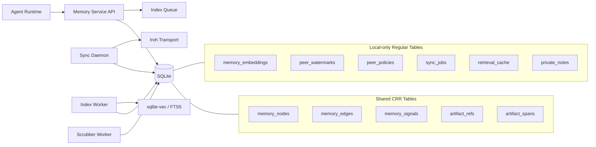

# CRDT-Agent-Memory Detailed Design Pack

Status: Draft v0.2
Date: 2026-03-10
Scope: Detailed architecture pack derived from `../crdt-agent-memory-spec.md`

## 1. Final Architecture Judgment

MVP の推奨構成は次のとおり。

- Language: Go
- Canonical storage: SQLite
- Shared-memory replication: cr-sqlite
- P2P transport: Iroh
- Lexical retrieval: FTS5
- Semantic retrieval: sqlite-vec
- Identity and signatures: Ed25519

この構成で一番重要なのは、技術の責務境界を厳密に切ることだ。

| 責務 | 真実の置き場所 | 採用技術 | 明示的に使わない場所 |
| --- | --- | --- | --- |
| 保存 | 構造化メモリ本体 | SQLite | ベクトルを共有真実にしない |
| 同期 | CRR テーブルの差分 | cr-sqlite + Iroh | Iroh に競合解決をさせない |
| 想起 | ローカル索引と再ランキング | FTS5 + sqlite-vec | sqlite-vec を共有同期しない |
| 信頼 | peer identity と署名、allowlist、trust weight | Ed25519 + local policy tables | CRDT に信頼ポリシーの最終判断を委ねない |

## 2. High-Level System View

## 3. Core Design Rules

- `cr-sqlite` は shared CRR tables のみに使う
- `Iroh` は encrypted stream transport のみに使う
- `sqlite-vec` は local derived index のみに使う
- memory 本文の意味変更は overwrite ではなく `supersede` で表現する
- `confidence` や `salience` は mutable scalar ではなく signal event として蓄積する
- `private` scope の記憶は同じ DB に存在しても同期送信しない

## 4. Document Map

- [technology-decisions.md](./technology-decisions.md)
  - 技術選定、責務分離、一次情報ベースの比較
- [workflows.md](./workflows.md)
  - 保存、同期、想起、訂正、障害時再試行の流れ
- [data-model-erd.md](./data-model-erd.md)
  - ERD、テーブル区分、関係、モデリング原則
- [non-functional-requirements.md](./non-functional-requirements.md)
  - 性能、可用性、セキュリティ、運用要件
- [testing-strategy.md](./testing-strategy.md)
  - テストレイヤ、環境、CI、故障注入
- [tdd-workflow.md](./tdd-workflow.md)
  - 実装順序、Red-Green-Refactor の切り方

## 5. Verified Primary Sources Snapshot

2026-03-10 時点で設計判断に使った一次情報。

- `cr-sqlite` quickstart: https://vlcn.io/docs/cr-sqlite/quickstart
- `cr-sqlite` constraints: https://www.vlcn.io/docs/cr-sqlite/constraints
- `cr-sqlite` whole CRR sync: https://www.vlcn.io/docs/cr-sqlite/networking/whole-crr-sync
- `Iroh` overview: https://www.iroh.computer/docs/overview
- `Iroh` relays: https://docs.iroh.computer/concepts/relays
- `Iroh` node tickets: https://docs.iroh.computer/concepts/tickets
- `Iroh` endpoint IDs: https://docs.iroh.computer/concepts/identifiers
- `sqlite-vec`: https://github.com/asg017/sqlite-vec
- `PowerSync` sync-postgres: https://www.powersync.com/sync-postgres
- `Ditto` about: https://docs.ditto.live/home/about-ditto
- `SQLite Sync`: https://github.com/sqliteai/sqlite-sync

