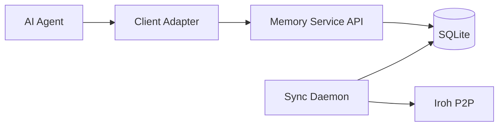
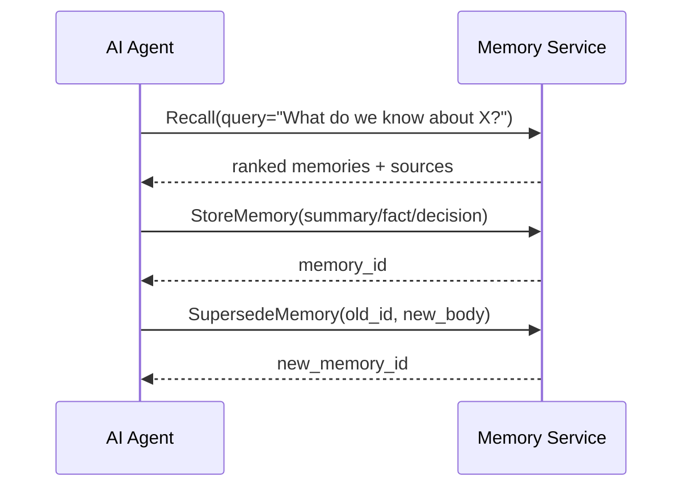
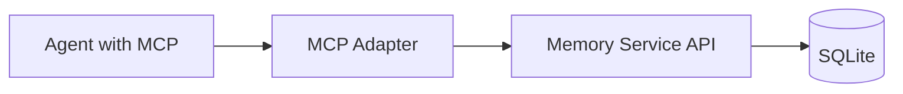
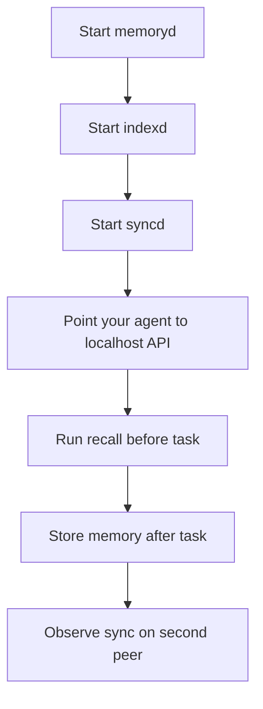

# Agent Integration And Distribution

Status: Draft v0.1
Date: 2026-03-10

## 1. Short Answer

このシステムのコアは `pnpm install` してライブラリとして埋め込むものではない。

MVP の基本形は次のとおり。

- core runtime: Go 製のローカル daemon
- agent connection: MCP adapter, HTTP API, または gRPC
- storage and sync: ローカル SQLite + `cr-sqlite` + Iroh
- optional JS/TS package: あっても thin client に留める

つまり使い方は、

1. ローカルで memory service を起動する
2. AI agent はその service に対して `store`, `recall`, `supersede` を呼ぶ
3. 他 peer とは service の裏側で sync daemon が同期する

## 2. What The Agent Actually Talks To

AI agent は SQLite に直接つながない。原則として `Memory Service` に接続する。



理由:

- agent に `cr-sqlite` や Iroh の詳細を持たせないため
- write/read policy を一箇所に集約するため
- private/shared routing、署名、index queue、sync trigger を API 層で吸収するため

## 3. Recommended Integration Modes

既存 client に繋ぐなら、MCP adapter を第一候補にする。

優先順位:

1. MCP adapter
2. Local HTTP API
3. gRPC

理由:

- Claude Desktop や Cursor に最短で刺さる
- core を変えずに接続面だけ追加できる
- Go binary 配布と相性が良い

### Mode A: MCP Adapter

既存 AI クライアントへ繋ぐなら最初に一番おすすめなのはこれ。

- `memoryd` の前段または同梱で MCP server を立てる
- Claude Desktop / Cursor は MCP で接続する
- core の SQLite / CRDT / sync 設計には MCP を食い込ませない

向いているもの:

- Claude Desktop
- Cursor
- MCP 対応 agent host 全般

重要:

- MCP は core ではなく adapter
- canonical behavior は常に memory service API で定義する

### Mode B: Local HTTP API

- `memoryd` を localhost で起動
- agent は HTTP で呼ぶ
- 言語を問わず使いやすい

向いているもの:

- 自作 agent
- CLI agent
- Python/Node/Go 混在環境

### Mode C: gRPC

- 型安全を強くしたい場合
- 複数の internal services から使う場合

向いているもの:

- backend service integration
- strongly typed SDK generation

## 4. Why Not `pnpm install` As The Primary Form

`pnpm install` 形式を主にしない理由:

- コアが Go + SQLite extension + P2P transport だから
- `cr-sqlite` や `sqlite-vec` のネイティブ依存を JS package の責務にすると重い
- Node 専用にすると Python/Go 系 agent から使いにくい
- daemon と API に分けた方が multi-agent / multi-language で再利用しやすい

Inference:

- Node package は「あっても client SDK または MCP wrapper」として作る方が自然

## 5. Distribution Strategy

### Primary Distribution

- single binary or a few Go binaries
- local config files
- SQLite file
- native extensions

例:

```text
memoryd
syncd
indexd
config.yaml
agent_memory.sqlite
crsqlite.dylib
sqlite_vec.dylib
```

### Optional Distribution Layers

- npm package: thin HTTP/gRPC client
- npm package: MCP server wrapper
- Python package: thin client
- Docker image: local self-host deployment

## 6. How An AI Agent Uses It

AI agent から見た最低限の API は次の 4 つ。

- `StoreMemory`
- `Recall`
- `SupersedeMemory`
- `SignalMemory`

### Example Usage Pattern



## 7. Typical Agent Integration Patterns

### Pattern A: Pre-Tool Recall

agent がタスクを始める前に memory を引く。

例:

1. user asks a coding question
2. agent calls `Recall`
3. agent gets prior decisions, code context, known caveats
4. agent works using that context

### Pattern B: Post-Task Memory Write

agent が作業後に memory を保存する。

例:

1. agent reads docs or code
2. agent derives a stable fact or summary
3. agent calls `StoreMemory`
4. memory becomes locally searchable and later syncable

### Pattern C: Decision Journal

agent の判断理由を残す。

例:

1. agent chooses Iroh over another transport
2. stores a `decision`
3. links supporting sources via `artifact_refs` and `memory_edges`

### Pattern D: Team Memory Sharing

agent A が学んだことを agent B が後で使う。

例:

1. peer A stores shared memory
2. sync daemon pushes shared changes
3. peer B recalls them locally

## 8. API Shape Developers Should Assume

MVP ではこの程度の API を想定する。

### HTTP examples

```http
POST /v1/memories
POST /v1/memories/recall
POST /v1/memories/{id}/supersede
POST /v1/memories/{id}/signals
GET /v1/health
GET /v1/diagnostics/sync
```

### Request example

```json
{
  "memory_type": "fact",
  "visibility": "shared",
  "namespace": "team/dev",
  "subject": "cr-sqlite",
  "body": "crsql_changes is not a full immutable transaction log.",
  "source_uri": "https://vlcn.io/docs/cr-sqlite/transactions"
}
```

### Recall response example

```json
{
  "items": [
    {
      "memory_id": "01H...",
      "memory_type": "fact",
      "body": "crsql_changes is not a full immutable transaction log.",
      "score": 0.92,
      "sources": [
        {
          "uri": "https://vlcn.io/docs/cr-sqlite/transactions"
        }
      ]
    }
  ]
}
```

## 9. MCP Integration Shape

MCP で出すなら、たとえば次の tools が自然。

- `memory_recall`
- `memory_store`
- `memory_supersede`
- `memory_signal`
- `memory_trace_decision`
- `memory_explain`
- `memory_sync_status`

MVP 方針:

- tools first
- stdio first
- Streamable HTTP second
- resources/prompts は second step



MCP adapter の責務:

- tool schema 定義
- memory service への API 中継
- auth / local socket / localhost endpoint 管理

MCP adapter の責務ではないもの:

- SQLite access
- sync protocol
- CRDT merge
- client-specific transport policy

## 10. Node / pnpm Story

もし Node 開発者向けに出すなら、形は 2 つある。

### Option 1: thin client package

```bash
pnpm add @crdt-agent-memory/client
```

用途:

- localhost の `memoryd` に HTTP/gRPC で接続する client

中に入れないもの:

- SQLite
- `cr-sqlite`
- Iroh runtime

### Option 2: MCP wrapper package

```bash
pnpm add @crdt-agent-memory/mcp
```

用途:

- Node 環境から MCP server として memory service を expose

### Non-recommended for MVP

```bash
pnpm add @crdt-agent-memory/core
```

これを非推奨にする理由:

- native dependency bundling が重い
- cross-platform support が難しい
- core responsibilities が JS package に過剰に寄る

## 11. Python Story

Python agent からも同じ考え方で使う。

- `memoryd` を起動
- Python client で HTTP/gRPC 接続

つまり Node 特化ではない。

## 12. Daily Usage From An Agent Developer Perspective

### During development

1. `memoryd`, `indexd`, `syncd` を起動
2. agent を localhost endpoint に向ける
3. `Recall` を task start 時に呼ぶ
4. `StoreMemory` を task end 時に呼ぶ
5. 必要なら `SupersedeMemory` で修正する

### During team usage

1. 各開発者 PC で daemon を動かす
2. allowlisted peers 同士で shared memory を同期する
3. 各 agent はローカル daemon を読むだけでよい

## 13. Recommended First User Experience

最初の体験としては次が一番自然。



## 14. Practical Recommendation

結論:

- core は Go daemon
- 既存クライアントとの接続はまず MCP
- 自作 agent との接続は HTTP か gRPC
- `pnpm` は optional client/wrapper distribution
- 最初は `pnpm install して library import` ではなく `local service を立てて使う` と考えるべき
