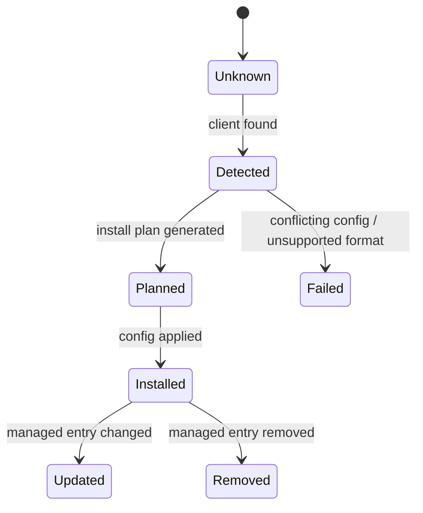

# Client Adapter Lifecycle

Status: Draft v0.1
Date: 2026-03-10

## 1. Purpose

この文書は client adapter の install / update / remove / detect の責務を固定する。

対象 client:

- Claude Desktop
- Claude Code
- Codex
- Cursor
- Gemini CLI
- OpenCode

## 2. Adapter Responsibility Boundary

adapter が持つ責務:

- client の存在検出
- config authority の特定
- MCP server registration の追加
- managed entry の更新
- managed entry の削除
- dry-run と diagnostics

adapter が持たない責務:

- tool behavior
- memory semantics
- sync semantics
- SQLite access

## 3. Lifecycle States



## 4. Operating Modes

### Detect

- find whether the client is installed
- find config authority path
- report supported transport surface

### Plan

- produce deterministic install/update/remove plan
- may output patch/snippet without applying

### Apply

- change config only when ownership can be proven

## 5. Install Policy

default policy is fail-closed and ownership-aware.

Rules:

- if adapter can safely edit config with structure awareness, it may auto-apply
- if safe editing is uncertain, adapter must emit a deterministic patch/snippet instead of guessing
- install must be idempotent for the same server name and same command spec
- install must not overwrite unrelated existing MCP entries

## 6. Update Policy

update is allowed only for managed entries.

Managed entry means one of:

- explicit ownership marker exists
- exact server name and executable fingerprint match prior install metadata
- config format supports a scoped managed block

If ownership is not provable:

- update must fail closed
- adapter should output a manual migration suggestion

## 7. Remove Policy

remove only removes what the adapter can prove it owns.

Rules:

- remove must target a specific server name
- remove must not delete user-created entries with similar commands unless ownership matches
- if ownership cannot be proven, removal becomes manual guidance, not destructive edit

## 8. Merge Policy

config merge policy must be explicit.

Default:

- preserve unrelated entries
- update only one named managed entry
- on duplicate conflicting server names:
  - fail closed
  - emit diagnostic

## 9. Server Naming Policy

default server names:

- primary: `group-memory`
- optional environment suffix: `group-memory-dev`, `group-memory-team`

Rules:

- names must be deterministic
- names must be unique per config scope
- adapters must not invent random server names

## 10. Suggested Adapter Interface

```go
type ClientAdapter interface {
    ID() string
    Detect(ctx context.Context, homeDir string) (installed bool, details string, err error)
    ConfigAuthority(homeDir string, projectDir string) []string
    SupportsMCP() bool
    PreferredMCPTransport() string
    SupportsTools() bool
    SupportsResources() bool
    SupportsPrompts() bool
    PlanInstall(ctx context.Context, spec MCPInstallSpec) (AdapterPlan, error)
    ApplyInstall(ctx context.Context, plan AdapterPlan) error
    PlanUpdate(ctx context.Context, spec MCPInstallSpec) (AdapterPlan, error)
    ApplyUpdate(ctx context.Context, plan AdapterPlan) error
    PlanRemove(ctx context.Context, serverName string) (AdapterPlan, error)
    ApplyRemove(ctx context.Context, plan AdapterPlan) error
}
```

## 11. Plan Structure

```go
type AdapterPlan struct {
    ClientID           string
    Action             string
    ConfigPath         string
    ManagedServerName  string
    OwnershipMode      string
    SafeToAutoApply    bool
    PatchPreview       string
    ManualInstructions []string
}
```

## 12. Ownership Strategy

preferred ownership proof order:

1. explicit config marker supported by host
2. server-name + command-path + args fingerprint
3. external install-state file keyed by config path and server name

If none works:

- adapter should not claim ownership

## 13. Capability Downgrade Rules

client capability differences must not change core functionality.

Rules:

- if client supports tools only:
  - register tools only
- if client supports resources/prompts:
  - tools still remain canonical
- if client lacks preferred transport:
  - downgrade to the best supported transport or fail with explicit reason

## 14. HTTP Phase 2 Security Gates

before enabling `Streamable HTTP` for a client:

- bind policy is defined
- `127.0.0.1` vs public exposure is explicit
- auth mechanism is fixed
- origin validation policy is fixed
- reverse proxy story is fixed
- TLS/public endpoint policy is fixed

If these are not satisfied:

- adapter must not auto-install HTTP mode

## 15. Recommended Default Behavior

MVP defaults:

- install stdio mode first
- auto-apply only when config ownership is safe
- otherwise emit patch/snippet
- remove only managed entries
- keep one canonical server name per environment

