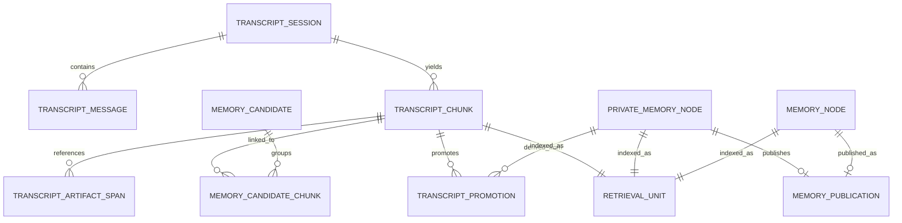

# Data Model And ERD

Status: Current reference
Date: 2026-03-26

## Modeling Principles

- shared memory だけが CRDT sync lane に入る
- private memory と transcript は local-only
- transcript chunk は append-only
- candidate は private memory の前段バッファ
- retrieval は source table ごとの二重実装ではなく `retrieval_units` に寄せる

## Table Families

### Shared

- `memory_nodes`
- `memory_edges`
- `memory_signals`
- `artifact_refs`
- `artifact_spans`

### Private

- `private_memory_nodes`
- `private_memory_edges`
- `private_memory_signals`
- `private_artifact_refs`
- `private_artifact_spans`

### Transcript / Promotion

- `transcript_sessions`
- `transcript_messages`
- `transcript_chunks`
- `transcript_artifact_spans`
- `transcript_promotions`
- `memory_publications`
- `memory_candidates`
- `memory_candidate_chunks`

### Retrieval / Index / Ops

- `retrieval_units`
- `retrieval_index_queue`
- `retrieval_embeddings`
- `memory_verification_state`
- `peer_policies`
- sync / scrubber / diagnostics 系 local table

## High-Level ERD

## Key Semantics

### Transcript

- `transcript_messages` は raw fact
- `transcript_chunks` は deterministic derived unit
- `chunk_strategy_version` を持ち、旧 version を破壊しない

### Candidates

- ingest 時に `decision`, `task_candidate`, `rationale`, `debug_trace` から生成される
- `memory_candidates.status` は `pending`, `approved`, `rejected`
- approve 時にのみ `private_memory_nodes` が作られる

### Structured Memory

- `private_memory_nodes` は promote 後の local structured memory
- `memory_nodes` は publish 後の shared structured memory

### Retrieval

- `retrieval_units` は transcript / private / shared を共通検索単位にする
- transcript recall では各 session の最新 `chunk_strategy_version` のみを対象にする
- old transcript chunk は provenance 用に残す
