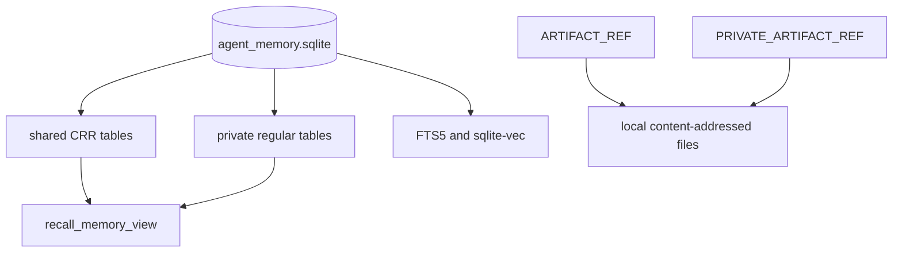

# Data Model And ERD

Status: Draft v0.3
Date: 2026-03-10

## 1. Modeling Principles

- shared data は CRR tables に限定する
- private structured memory は最初から local-only regular tables に分ける
- semantic content は append-mostly
- logical relations は DB foreign key ではなく application-level integrity と scrubber で守る
- shared sync cursor の正本は `crsql_tracked_peers`
- transport metadata は app-owned local tables に分離する
- signed payload と mutable lifecycle metadata を分ける

## 2. Table Classification

### Shared CRR Tables

- `memory_nodes`
- `memory_edges`
- `memory_signals`
- `artifact_refs`
- `artifact_spans`
- `crsql_tracked_peers` extension-managed cursor table

### Local-Only Regular Tables

- `private_memory_nodes`
- `private_memory_edges`
- `private_memory_signals`
- `private_artifact_refs`
- `private_artifact_spans`
- `memory_embeddings`
- `peer_sync_state`
- `peer_policies`
- `sync_jobs`
- `retrieval_cache`
- `private_notes`

## 3. ERD

```mermaid
erDiagram
    MEMORY_NODE {
        text memory_id PK
        text memory_type
        text namespace
        text scope
        text subject
        text body
        text source_uri
        text source_hash
        text author_agent_id
        text origin_peer_id
        bigint authored_at_ms
        bigint valid_from_ms
        bigint valid_to_ms
        text lifecycle_state
        int schema_version
        blob author_signature
    }

    MEMORY_EDGE {
        text edge_id PK
        text from_memory_id
        text to_memory_id
        text relation_type
        real weight
        text origin_peer_id
        bigint authored_at_ms
    }

    MEMORY_SIGNAL {
        text signal_id PK
        text memory_id
        text peer_id
        text agent_id
        text signal_type
        real value
        text reason
        bigint authored_at_ms
    }

    ARTIFACT_REF {
        text artifact_id PK
        text namespace
        text uri
        text content_hash
        text title
        text mime_type
        text origin_peer_id
        bigint authored_at_ms
    }

    ARTIFACT_SPAN {
        text span_id PK
        text artifact_id
        text memory_id
        int start_offset
        int end_offset
        text quote_hash
        bigint authored_at_ms
    }

    PRIVATE_MEMORY_NODE {
        text memory_id PK
        text local_namespace
        text memory_type
        text subject
        text body
        text source_uri
        text source_hash
        text author_agent_id
        text origin_peer_id
        bigint authored_at_ms
        bigint valid_from_ms
        bigint valid_to_ms
        text lifecycle_state
        int schema_version
        blob author_signature
    }

    PRIVATE_MEMORY_EDGE {
        text edge_id PK
        text from_memory_id
        text to_memory_id
        text relation_type
        real weight
        bigint authored_at_ms
    }

    PRIVATE_MEMORY_SIGNAL {
        text signal_id PK
        text memory_id
        text agent_id
        text signal_type
        real value
        text reason
        bigint authored_at_ms
    }

    PRIVATE_ARTIFACT_REF {
        text artifact_id PK
        text local_namespace
        text uri
        text content_hash
        text title
        text mime_type
        bigint authored_at_ms
    }

    PRIVATE_ARTIFACT_SPAN {
        text span_id PK
        text artifact_id
        text memory_id
        int start_offset
        int end_offset
        text quote_hash
        bigint authored_at_ms
    }

    MEMORY_EMBEDDING {
        text memory_space PK
        text memory_id PK
        text model_id
        int dim
        blob vector_blob
        text content_hash
        bigint indexed_at_ms
    }

    CRSQL_TRACKED_PEER {
        blob site_id PK
        bigint version
        int tag PK
        int event PK
    }

    PEER_SYNC_STATE {
        text peer_id PK
        text namespace PK
        bigint last_seen_at_ms
        text last_transport
        text last_path_type
        text last_error
        bigint last_success_at_ms
    }

    PEER_POLICY {
        text peer_id PK
        text trust_state
        real trust_weight
        text discovery_profile
        text relay_profile
        text notes
        bigint updated_at_ms
    }

    SYNC_JOB {
        text job_id PK
        text peer_id
        text namespace
        text direction
        text status
        int retry_count
        bigint next_attempt_at_ms
        text last_error
    }

    RETRIEVAL_CACHE {
        text cache_key PK
        text query_hash
        text namespace
        bigint expires_at_ms
        text payload_json
    }

    PRIVATE_NOTE {
        text note_id PK
        text body
        text tags_json
        bigint created_at_ms
        bigint updated_at_ms
    }

    MEMORY_NODE ||--o{ MEMORY_EDGE : "from"
    MEMORY_NODE ||--o{ MEMORY_EDGE : "to"
    MEMORY_NODE ||--o{ MEMORY_SIGNAL : "receives"
    MEMORY_NODE ||--o{ ARTIFACT_SPAN : "cited_by"
    ARTIFACT_REF ||--o{ ARTIFACT_SPAN : "provides"

    PRIVATE_MEMORY_NODE ||--o{ PRIVATE_MEMORY_EDGE : "from"
    PRIVATE_MEMORY_NODE ||--o{ PRIVATE_MEMORY_EDGE : "to"
    PRIVATE_MEMORY_NODE ||--o{ PRIVATE_MEMORY_SIGNAL : "receives"
    PRIVATE_MEMORY_NODE ||--o{ PRIVATE_ARTIFACT_SPAN : "cited_by"
    PRIVATE_ARTIFACT_REF ||--o{ PRIVATE_ARTIFACT_SPAN : "provides"

    PEER_POLICY ||--o{ PEER_SYNC_STATE : "governs"
    PEER_POLICY ||--o{ SYNC_JOB : "limits"
```

## 4. Key Table Semantics

### `memory_nodes`

役割:

- shared memory の基本単位
- `fact`, `decision`, `task`, `summary`, `artifact_ref`, `observation`, `preference` を格納

重要ルール:

- `scope` は `team`, `project`, `global` のみ
- private visibility はこの table に入れない
- `authored_at_ms` は author clock による advisory metadata
- `author_signature` は immutable canonical payload のみを署名する

### `private_memory_nodes`

役割:

- local-only private memory の基本単位

重要ルール:

- shared sync の対象外
- shared schema と似せるが、同期互換のために CRR 化しない

### `memory_edges` / `private_memory_edges`

役割:

- supporting, contradicting, about, derived_from, supersedes などの関係を表す

重要ルール:

- orphan edge は scrubber が検知する
- FK 依存ではなく logical integrity と repair を使う

### `memory_signals` / `private_memory_signals`

役割:

- trust, reinforcement, deprecation を event として持つ

重要ルール:

- `confidence` の current value を 1 列で持たない
- aggregation は read-path または background job で算出

### `artifact_refs` / `artifact_spans`

役割:

- source traceability
- code/doc snippet との紐付け

重要ルール:

- artifact 実体の自動複製は MVP 外
- URI 不達でも memory 自体は残す

### `memory_embeddings`

役割:

- ローカル recall acceleration

重要ルール:

- `memory_space` は `shared` または `private`
- shared truth ではない
- sync apply 後に再構築対象となる

### `crsql_tracked_peers`

役割:

- shared sync cursor の正本

重要ルール:

- table shape is extension-owned, not app-designed
- current documented structure is `site_id`, `version`, `tag`, `event`
- primary key is `(site_id, tag, event)`
- tag `0` means whole-database sync set
- event `0` is receive, event `1` is send
- app code は cursor の二重管理をしない
- app-specific telemetry は `peer_sync_state` に逃がす

## 5. Write-Side Constraints

| Constraint | Reason | Enforcement |
| --- | --- | --- |
| primary key は UUIDv7/ULID | P2P で衝突を避ける | app + db |
| non-PK unique を前提にしない | `cr-sqlite` 制約 | app |
| checked foreign key を前提にしない | `cr-sqlite` 制約 | scrubber |
| semantic overwrite を避ける | merge で意味が壊れる | write API |
| deletion は tombstone or lifecycle transition | 監査と同期安全性 | write API |
| signed payload は immutable fields のみに限定 | merge 後の mutable state を壊さない | write API |

## 6. Suggested Storage Layout

## 7. Data Lifecycle Notes

1. write API routes to shared or private table family
2. edges and signals are appended in the same family
3. local indexing updates `memory_embeddings`
4. only shared family participates in peer sync
5. later supersede or retract updates lifecycle state
6. long-term compaction by summary generation remains local application logic

## 8. Temporal And Signature Caveats

- `authored_at_ms` is not an ordering truth for sync
- sync ordering truth comes from CRDT metadata such as `db_version` and `col_version`
- clock skew is tolerated because authored time is advisory only
- signature verification checks canonical app payload, not extension-managed CRDT metadata

## 9. Transaction Fidelity Caveats

- `crsql_changes` is not a full immutable event log
- it stores current state plus merge metadata, not every historical mutation forever
- later writes can obscure parts of earlier transactions when querying by older `db_version`
- therefore local SQLite transactions remain atomic locally, but transaction fidelity across peers is not fully preserved by default sync
- if exact command-level replay boundaries matter, app-owned outbound batch logging is required

## 10. ERD Caveats

- Mermaid 上では relation を描いているが、DB レベルの checked FK を意味しない
- relation integrity は scrubber と query-side null tolerance で守る
- `crsql_tracked_peers` は extension-managed table であり、app-owned schema とは少し扱いが違う
