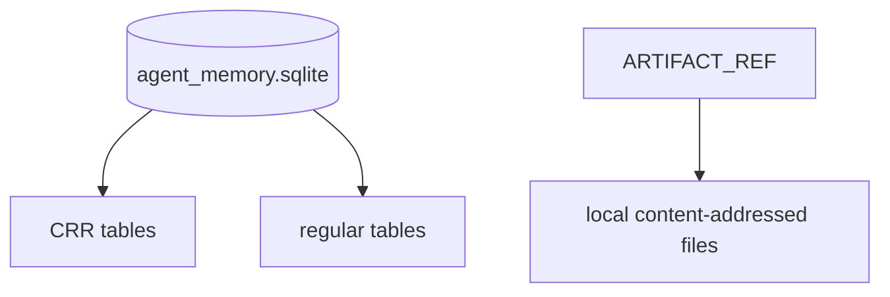

# Data Model And ERD

Status: Draft v0.2
Date: 2026-03-10

## 1. Modeling Principles

- shared data は CRR tables に限定する
- local-only data は regular tables に置く
- semantic content は append-mostly
- logical relations は DB foreign key ではなく application-level integrity と scrubber で守る
- private memory は同一 DB に存在しても同期送信対象にしない

## 2. Table Classification

### Shared CRR Tables

- `memory_nodes`
- `memory_edges`
- `memory_signals`
- `artifact_refs`
- `artifact_spans`

### Local-Only Regular Tables

- `memory_embeddings`
- `peer_watermarks`
- `peer_policies`
- `sync_jobs`
- `retrieval_cache`
- `private_notes`

## 3. ERD

```mermaid
erDiagram
    MEMORY_NODE {
        text memory_id PK
        text memory_type
        text namespace
        text scope
        text subject
        text body
        text source_uri
        text source_hash
        text author_agent_id
        text origin_peer_id
        bigint valid_from_ms
        bigint valid_to_ms
        bigint created_at_ms
        text state
        text supersedes_memory_id
        int schema_version
        blob signature
    }

    MEMORY_EDGE {
        text edge_id PK
        text from_memory_id
        text to_memory_id
        text relation_type
        real weight
        text origin_peer_id
        bigint created_at_ms
    }

    MEMORY_SIGNAL {
        text signal_id PK
        text memory_id
        text peer_id
        text agent_id
        text signal_type
        real value
        text reason
        bigint created_at_ms
    }

    ARTIFACT_REF {
        text artifact_id PK
        text namespace
        text uri
        text content_hash
        text title
        text mime_type
        text origin_peer_id
        bigint created_at_ms
    }

    ARTIFACT_SPAN {
        text span_id PK
        text artifact_id
        text memory_id
        int start_offset
        int end_offset
        text quote_hash
        bigint created_at_ms
    }

    MEMORY_EMBEDDING {
        text memory_id PK
        text model_id
        int dim
        blob vector_blob
        text content_hash
        bigint indexed_at_ms
    }

    PEER_WATERMARK {
        text peer_id PK
        text namespace PK
        bigint last_sent_version
        bigint last_applied_version
        bigint last_seen_at_ms
    }

    PEER_POLICY {
        text peer_id PK
        text trust_state
        real trust_weight
        text allowlist_group
        text notes
        bigint updated_at_ms
    }

    SYNC_JOB {
        text job_id PK
        text peer_id
        text namespace
        text direction
        text status
        int retry_count
        bigint next_attempt_at_ms
        text last_error
    }

    RETRIEVAL_CACHE {
        text cache_key PK
        text query_hash
        text namespace
        bigint expires_at_ms
        text payload_json
    }

    PRIVATE_NOTE {
        text note_id PK
        text body
        text tags_json
        bigint created_at_ms
        bigint updated_at_ms
    }

    MEMORY_NODE ||--o{ MEMORY_EDGE : from
    MEMORY_NODE ||--o{ MEMORY_EDGE : to
    MEMORY_NODE ||--o{ MEMORY_SIGNAL : receives
    MEMORY_NODE ||--o| MEMORY_EMBEDDING : derives
    MEMORY_NODE ||--o{ ARTIFACT_SPAN : cited_by
    ARTIFACT_REF ||--o{ ARTIFACT_SPAN : provides
    PEER_POLICY ||--o{ PEER_WATERMARK : governs
    PEER_POLICY ||--o{ SYNC_JOB : limits
```

## 4. Key Table Semantics

### `memory_nodes`

役割:

- 共有記憶の基本単位
- `fact`, `decision`, `task`, `summary`, `artifact_ref`, `observation`, `preference` を格納

重要ルール:

- semantic body update は原則新規 row
- `state` は `active`, `superseded`, `retracted`, `deleted`
- `scope='private'` は送信対象外

### `memory_edges`

役割:

- supporting, contradicting, about, derived_from, supersedes などの関係を表す

重要ルール:

- orphan edge は scrubber が検知する
- FK 依存ではなく logical integrity と repair を使う

### `memory_signals`

役割:

- trust, reinforcement, deprecation を event として持つ

重要ルール:

- `confidence` の current value を 1 列で持たない
- aggregation は read-path または background job で算出

### `artifact_refs` / `artifact_spans`

役割:

- source traceability
- code/doc snippet との紐付け

重要ルール:

- artifact 実体の自動複製は MVP 外
- URI 不達でも memory 自体は残す

### `memory_embeddings`

役割:

- ローカル recall acceleration

重要ルール:

- shared truth ではない
- sync apply 後に再構築対象となる

## 5. Write-Side Constraints

| Constraint | Reason | Enforcement |
| --- | --- | --- |
| primary key は UUIDv7/ULID | P2P で衝突を避ける | app + db |
| non-PK unique を前提にしない | `cr-sqlite` 制約 | app |
| checked foreign key を前提にしない | `cr-sqlite` 制約 | scrubber |
| semantic overwrite を避ける | merge で意味が壊れる | write API |
| deletion は tombstone | 監査と同期安全性 | write API |

## 6. Suggested Storage Layout



## 7. Data Lifecycle Notes

1. `memory_nodes` 作成
2. `memory_edges` と `memory_signals` 追加
3. local indexing
4. optional peer sync
5. later supersede or retract
6. long-term compaction by summary generation

## 8. ERD Caveats

- Mermaid 上では relation を描いているが、DB レベルの checked FK を意味しない
- relation integrity は scrubber と query-side null tolerance で守る
- `peer_policies` は local table であり、同期対象にしない

