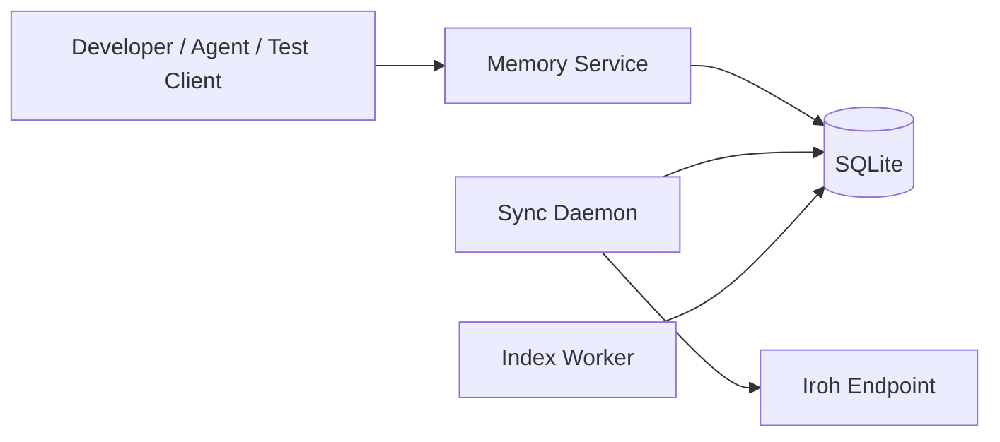
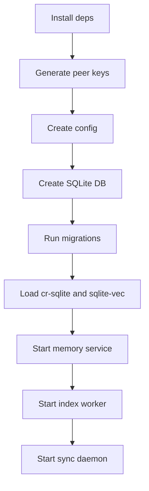
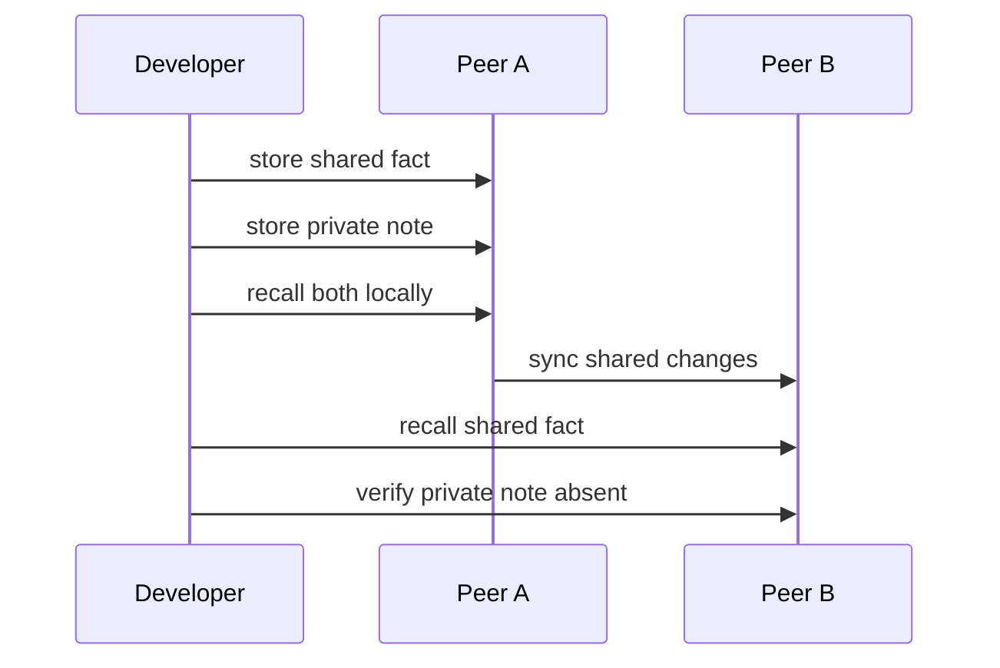
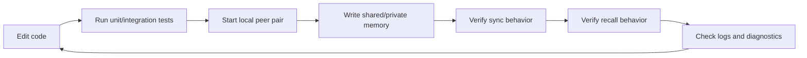

# Developer Setup And Usage

Status: Draft v0.1
Date: 2026-03-10

## 1. Purpose

この文書は、開発者が `CRDT-Agent-Memory` をローカルで立ち上げ、2 peer 以上で同期を試し、日常的に開発・検証するための実践ガイドである。

対象:

- 開発者の初回セットアップ
- 2 peer ローカル検証
- 日常の開発フロー
- 同期トラブル時の確認手順

## 2. What A Developer Actually Runs

MVP で開発者が触る実体は次の 4 つ。

- `memory service`
  - write/read API を提供するプロセス
- `sync daemon`
  - peer discovery、handshake、delta sync を行うプロセス
- `index worker`
  - FTS5 と sqlite-vec の再索引を行うプロセス
- `sqlite database`
  - shared/private memory と local state の保存先



## 3. Expected Repo Shape

実装段階では、最低でも次の構成を想定する。

```text
/cmd/memoryd
/cmd/syncd
/cmd/indexd
/configs/
/migrations/
/scripts/
/docs/architecture/
```

補足:

- `memoryd`: API サーバ
- `syncd`: peer 間同期
- `indexd`: 再索引 worker
- `configs/`: peer registry、relay/discovery profile、namespace policy
- `migrations/`: SQLite と CRR schema migration

## 4. Prerequisites

ローカル開発に必要なもの:

- Go toolchain
- SQLite
- `cr-sqlite` extension binary
- `sqlite-vec` extension binary
- Iroh runtime dependency or linked library
- 2 つ以上のローカル作業ディレクトリまたは 2 プロセス分の config

推奨:

- `make` または task runner
- `jq`
- `sqlite3` CLI

## 5. Local Environment Layout

1 台の開発マシンで 2 peer を動かす最小構成例:

```text
/tmp/crdt-agent-memory/
  peer-a/
    config.yaml
    agent_memory.sqlite
    data/
  peer-b/
    config.yaml
    agent_memory.sqlite
    data/
```

各 peer で分けるもの:

- SQLite file
- peer keypair
- Iroh endpoint config
- relay/discovery profile
- peer registry entry
- logs

共有してよいもの:

- binary
- schema migration files
- test documents

## 6. Configuration Model

各 peer は最低限次を持つ。

- `peer_id`
- `listen_addr`
- `database_path`
- `namespace_allowlist`
- `peer_registry`
- `relay_profile`
- `discovery_profile`
- `signing_key_path`
- `extensions`

例:

```yaml
peer_id: "endpointid:peer-a"
database_path: "/tmp/crdt-agent-memory/peer-a/agent_memory.sqlite"
signing_key_path: "/tmp/crdt-agent-memory/peer-a/peer.key"

extensions:
  crsqlite_path: "/usr/local/lib/crsqlite.dylib"
  sqlite_vec_path: "/usr/local/lib/sqlite_vec.dylib"

transport:
  discovery_profile: "dev-default"
  relay_profile: "dev-default"

namespaces:
  - "team/dev"

peer_registry:
  - peer_id: "endpointid:peer-b"
    display_name: "peer-b"
    namespace_allowlist: ["team/dev"]
    discovery_profile: "dev-default"
    relay_profile: "dev-default"
```

## 7. First-Time Setup Flow



### Step 1: install dependencies

- install Go
- install SQLite CLI
- place `cr-sqlite` and `sqlite-vec` shared libraries where config can reference them

### Step 2: generate peer identity

各 peer ごとに Ed25519 keypair を生成する。

成果物:

- private key file
- public key / `EndpointID`

### Step 3: create config

- peer ごとの config を作る
- `EndpointID` ベースで peer registry を作る
- dev と prod で relay/discovery profile を分ける

### Step 4: initialize database

- SQLite file を作成
- app-owned schema migration を適用
- shared tables を CRR 化
- local-only tables を初期化

### Step 5: start services

順序:

1. `memory service`
2. `index worker`
3. `sync daemon`

理由:

- API が先に起動していればローカル書き込み検証ができる
- sync は DB と policy が揃ってからでよい

## 8. Recommended Developer Commands

実装時に想定する代表コマンド。

```bash
make dev-peer-a
make dev-peer-b
make migrate-peer-a
make migrate-peer-b
make smoke-sync
make test
```

もし `make` を使わないなら:

```bash
go run ./cmd/memoryd --config /tmp/crdt-agent-memory/peer-a/config.yaml
go run ./cmd/indexd --config /tmp/crdt-agent-memory/peer-a/config.yaml
go run ./cmd/syncd --config /tmp/crdt-agent-memory/peer-a/config.yaml
```

## 9. First Smoke Test

最初に確認すべきことは 3 つだけ。

1. 単一 peer で shared memory を保存して想起できる
2. private memory が local にだけ残る
3. peer A の shared memory が peer B に同期される

### Smoke test procedure



期待結果:

- A では shared/private とも見える
- B では shared のみ見える
- B に private family の row が作られない

## 10. Day-To-Day Developer Workflow



日常の基本ループ:

1. テストを書く
2. ローカル 1 peer で write/read を確認する
3. ローカル 2 peer で sync を確認する
4. private leak がないかを見る
5. schema hash と tracked peer cursor を確認する

## 11. Typical Developer Scenarios

### Scenario A: adding a new shared memory field

やること:

- shared schema を変更する
- migration を追加する
- `schema_hash` と `crr_manifest_hash` を更新する
- migration smoke test を足す
- mixed-schema sync が fence されることを確認する

やってはいけないこと:

- 片方の peer だけ migration 済みで shared sync を続行すること

### Scenario B: changing private-only features

やること:

- `private_memory_*` family または local tables を変える
- local-only migration として適用する

補足:

- private/local-only change は shared sync fence を必須にしない

### Scenario C: onboarding a new peer

やること:

- 新規 peer の keypair を生成
- `EndpointID` を peer registry に追加
- 必要なら初回だけ invite ticket を使う
- allowlist と namespace policy を反映
- sync smoke test 実施

### Scenario D: schema mismatch debugging

見るべきもの:

- `protocol_version`
- `min_compatible_protocol_version`
- `schema_hash`
- `crr_manifest_hash`
- `crsql_tracked_peers`

## 12. Diagnostics Checklist

問題が起きたら、まず次を見る。

- peer A/B の `EndpointID`
- allowlist に相手がいるか
- namespace allowlist が一致しているか
- relay/discovery profile が意図どおりか
- `schema_hash` が一致しているか
- `crr_manifest_hash` が一致しているか
- `crsql_tracked_peers` が更新されているか
- `peer_sync_state.last_error` に何が入っているか
- sync apply 後に `index worker` が走っているか

## 13. Operational Guardrails For Developers

- private データの確認は必ず DB レベルでも行う
- sync が通らない時は transport と schema を分けて疑う
- relay が使われていても、それは異常ではない
- transaction boundary が peer 側で完全再現される前提を置かない
- exact replay が必要な機能は app-owned log を別途設計する

## 14. Suggested Verification Queries

実装後に便利な確認観点。

```sql
-- shared memory count
select count(*) from memory_nodes;

-- private memory count
select count(*) from private_memory_nodes;

-- shared artifact count
select count(*) from artifact_refs;

-- private artifact count
select count(*) from private_artifact_refs;

-- tracked peer cursors
select * from crsql_tracked_peers;
```

注意:

- `crsql_tracked_peers` は extension-owned table なので、列の意味は docs と extension version を揃えて確認する

## 15. Minimum Demo Flow For Reviewers

レビューやデモでは次の流れが最小構成として見やすい。

1. peer A を起動
2. peer B を起動
3. A に shared fact を 1 件保存
4. A に private note を 1 件保存
5. A で recall 実行
6. B で sync 後 recall 実行
7. B に private note が存在しないことを確認
8. A の fact を supersede
9. B で新旧関係が追えることを確認

## 16. What This Guide Does Not Cover

- 本番デプロイ自動化
- dedicated relay の実運用設計
- backup/restore の自動化
- attachment body replication

