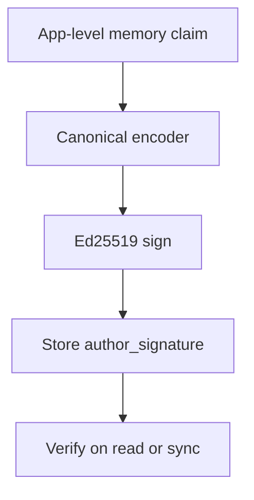

# Identity, Time, And Signatures

Status: Current reference
Date: 2026-03-26

## 1. Purpose

この文書は、peer identity、agent identity、時刻フィールド、署名対象の意味論を定義する。

## 2. Identity Model

| Concept | Meaning | Scope |
| --- | --- | --- |
| `peer_id` | Iroh `EndpointID` / Ed25519 public-key identity | node-wide |
| `agent_id` | logical agent identity within one peer | peer-local |
| `author_agent_id` | memory claim を生成した agent | per memory |
| `origin_peer_id` | memory claim の起点 peer | per memory |

## 3. Time Model

### Shared time fields

- `authored_at_ms`
- `valid_from_ms`
- `valid_to_ms`

### Local-only time fields

- `indexed_at_ms`
- `last_seen_at_ms`
- `last_success_at_ms`

### Time semantics

- `authored_at_ms` is the author clock at claim creation time
- `authored_at_ms` is not sync ordering truth
- sync ordering truth comes from CRDT metadata such as `db_version`, `col_version`, and peer cursor state
- temporal ranking may use `authored_at_ms`, but must tolerate skew

## 4. Signature Model

署名は row 全体ではなく immutable canonical payload に対して行う。

署名対象に含める:

- `memory_id`
- `memory_type`
- `namespace` or `local_namespace`
- `subject`
- `body`
- `source_uri`
- `source_hash`
- `author_agent_id`
- `origin_peer_id`
- `authored_at_ms`
- `valid_from_ms`
- `valid_to_ms`
- `payload_version`

署名対象に含めない:

- CRDT metadata
- `db_version`
- `col_version`
- `site_id`
- local transport metadata
- local indexing metadata
- mutable `lifecycle_state`

理由:

- merge 後に変わる extension-managed metadata を署名対象にすると運用不能になる
- lifecycle transitions は authored claim そのものとは責務が違う

## 5. Canonical Payload

推奨形式:

- deterministic JSON or canonical CBOR
- UTF-8 normalized
- omitted optional fields are serialized consistently

## 6. Supersede Semantics

- supersede creates a new signed memory claim
- old memory keeps its original signature
- relation edge `supersedes` expresses the update relation
- old row lifecycle may become `superseded`, but that lifecycle field is not part of the original author signature

## 7. Trust Semantics

- valid signature proves origin binding, not truthfulness
- trust score remains a local policy decision
- remote peer with valid signatures can still be low-trust

## 8. Ranking Guidance

Use time carefully:

- okay: recent memories receive a weak boost
- okay: validity windows affect filtering
- not okay: authored time defines causal ordering for sync
- not okay: unsynchronized clocks decide conflict resolution

## 9. Tests Required

- canonical payload serialization is deterministic
- signature verification succeeds across peers for the same immutable claim
- lifecycle update does not invalidate original signature semantics
- clock skew does not break sync convergence
