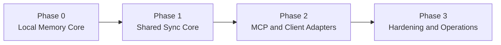
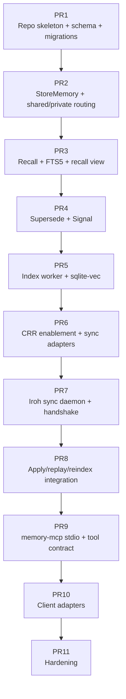

# Implementation Plan

Status: Draft v0.1
Date: 2026-03-12

## 1. Purpose

この文書は、`CRDT-Agent-Memory` を段階的に実装するための実装手順書である。

目的:

- 何から着手すべきかを固定する
- Phase ごとの完了条件を明確にする
- 1 PR ごとの実装単位まで落とす
- 途中で設計がぶれないようにする

## 2. Implementation Principles

- 先に local-only で成立させる
- shared sync はその後に足す
- MCP は core 完成後ではなく、Phase 1 の後半で adapter として載せる
- private/shared 分離は最初から守る
- `crsql_tracked_peers` を使う前提で sync を組む
- `stdio` MCP を先に作り、HTTP は後回し

## 3. Phase Overview

## 4. Phase 0: Local Memory Core

### Goal

- 単一ノードで memory service が成立すること
- shared/private の write/read が動くこと
- FTS5 と sqlite-vec を使った local recall ができること

### Build order

1. repository layout を作る
2. SQLite schema を作る
3. migration runner を作る
4. memory service の write API を作る
5. recall API を作る
6. supersede/signal API を作る
7. index worker を作る
8. diagnostics を追加する

### Must-have deliverables

- `memory_nodes` family と `private_memory_nodes` family
- `artifact_refs` family と `private_artifact_refs` family
- `memory_embeddings`
- local FTS5
- local vector indexing
- `recall_memory_view`

### Done criteria

- shared write が shared table family にだけ入る
- private write が private table family にだけ入る
- local recall が両 family を引ける
- supersede が append-plus-supersede で動く
- signal append が動く

## 5. Phase 1: Shared Sync Core

### Goal

- `cr-sqlite` による shared family の同期が成立すること
- Iroh transport 経由で 2 peer が eventual convergence すること

### Build order

1. shared tables の CRR enablement
2. `crsql_changes` extract/apply adapter
3. `crsql_tracked_peers` cursor integration
4. peer registry と allowlist
5. Iroh-based sync daemon
6. handshake with schema/protocol checks
7. apply after sync + reindex queue
8. sync diagnostics

### Must-have deliverables

- shared tables only CRR 化
- private tables remain regular
- sync daemon
- handshake message schema
- sync status endpoint
- quarantine path for failed apply

### Done criteria

- peer A の shared write が peer B に反映される
- private write は反映されない
- replay apply が安全
- schema mismatch で fence される
- `crsql_tracked_peers` が cursor truth として更新される

## 6. Phase 2: MCP And Client Adapters

### Goal

- `memory-mcp` を `stdio` で使える
- Claude Desktop / Claude Code / Cursor / Codex に登録できる

### Build order

1. `memory-mcp` process skeleton
2. tool contract 実装
3. MCP stdio transport
4. local memory service binding
5. adapter interface 実装
6. Claude Code adapter
7. Codex adapter
8. Cursor adapter
9. Claude Desktop adapter
10. Gemini CLI / OpenCode adapter skeleton

### Must-have deliverables

- `memory.store`
- `memory.recall`
- `memory.supersede`
- `memory.signal`
- `memory.trace_decision`
- `memory.explain`
- `memory.sync_status`

### Done criteria

- local MCP inspector equivalent で tools が見える
- stdio 経由で tool call が成功する
- Claude 系または Codex の最低 1 client で接続確認できる
- adapter install/remove が managed-entry のみを触る

## 7. Phase 3: Hardening And Operations

### Goal

- 運用と拡張に耐える

### Build order

1. signed payload verification
2. scrubber worker
3. richer diagnostics
4. migration fence automation
5. capability downgrade helpers
6. HTTP Phase 2 security design
7. Streamable HTTP MCP
8. remote-client support

### Done criteria

- signed payload verification が動く
- orphan detection が動く
- HTTP を有効化する時の security gates が実装済み
- remote MCP client を安全に扱える

## 8. Suggested PR Sequence

## 9. PR Breakdown

### PR1: Repo skeleton + schema + migrations

内容:

- `cmd/`, `internal/`, `migrations/`, `configs/` 作成
- base schema
- migration runner
- config loader

完了条件:

- empty DB を初期化できる

### PR2: `StoreMemory` + shared/private routing

内容:

- `memory.store` 相当の core API
- shared/private family への routing
- artifact/edge/signal の基本保存

完了条件:

- local write integration test 緑

### PR3: `Recall` + FTS5 + recall view

内容:

- recall query
- `recall_memory_view`
- lexical scoring

完了条件:

- local top-k recall が動く

### PR4: `Supersede` + `Signal`

内容:

- supersede API
- signal append API
- lifecycle state 更新

完了条件:

- overwrite を使わず更新できる

### PR5: Index worker + `sqlite-vec`

内容:

- index queue
- embedding rebuild
- hybrid retrieval

完了条件:

- shared/private 両方が semantic recall 可能

### PR6: CRR enablement + sync adapters

内容:

- shared table CRR 化
- `crsql_changes` extract/apply
- `crsql_tracked_peers` integration

完了条件:

- extension integration test 緑

### PR7: Iroh sync daemon + handshake

内容:

- peer registry
- EndpointID dialing
- schema/protocol/CRR manifest checks

完了条件:

- 2 peer handshake が動く

### PR8: Apply/replay/reindex integration

内容:

- sync apply
- replay safety
- reindex after apply
- sync diagnostics

完了条件:

- 2 peer end-to-end sync 緑

### PR9: `memory-mcp` stdio + tool contract

内容:

- MCP server process
- tools 実装
- stdio transport

完了条件:

- local MCP tool call が成功

### PR10: Client adapters

内容:

- adapter lifecycle contract
- Claude Code / Codex / Cursor / Claude Desktop adapters
- Gemini/OpenCode skeleton

完了条件:

- 少なくとも 2 client で install/remove を確認

### PR11: Hardening

内容:

- signature verification
- scrubber
- fence automation
- better diagnostics

完了条件:

- dogfood 可能

## 10. Testing Gates Per Phase

### Phase 0

- unit tests
- SQLite integration tests
- local recall tests

### Phase 1

- CRR integration tests
- 2-peer sync tests
- replay safety tests
- schema fence tests

### Phase 2

- MCP contract tests
- stdio integration tests
- adapter lifecycle tests

### Phase 3

- security tests
- scrubber tests
- migration tests

## 11. Recommended Daily Execution Order

開発者が日々やる順序:

1. docs を確認
2. small slice の failing test を書く
3. local-only 実装を通す
4. sync 影響があるなら 2-peer で検証
5. MCP 影響があるなら stdio integration で検証
6. diagnostics を確認

## 12. What Not To Do

- Phase 0 完了前に Iroh を入れない
- tool contract 固定前に client adapter を量産しない
- private/shared 分離を後回しにしない
- HTTP MCP を stdio より先に作らない
- signed payload を row-level mutable state と混ぜない

## 13. Recommended Immediate Next Step

今すぐ着手するなら次の順序がよい。

1. PR1
2. PR2
3. PR3

理由:

- ここまでで local memory substrate の価値が見える
- sync や MCP を足す前に core の write/read semantics を固められる

