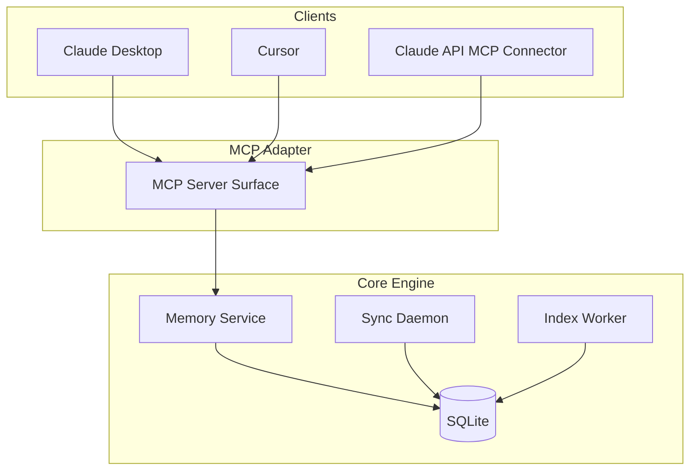

# MCP Integration

Status: Draft v0.1
Date: 2026-03-10

## 1. Judgment

MCP はこのプロジェクトにかなり自然に入る。

ただし位置づけは明確にする。

- MCP is adapter, not core
- core behavior is owned by `memory service`
- client-specific transport differences are absorbed by the MCP layer

## 2. Primary-Source Grounding

### MCP specification

- standard transports are `stdio` and `Streamable HTTP`
- clients SHOULD support `stdio` whenever possible

Source:

- MCP Transports spec page, verified on 2026-03-10 at revision `2025-06-18`:
  https://modelcontextprotocol.io/specification/2025-06-18/basic/transports

### Cursor

- Cursor docs describe MCP support for `stdio`, `SSE`, and `Streamable HTTP`
- docs also describe support for tools, prompts, resources, roots, and elicitation

Source:

- https://docs.cursor.com/en/context/mcp

### Claude API MCP connector

- Messages API can connect to remote MCP servers
- current support is tools only
- requires a publicly exposed HTTP server

Source:

- https://platform.claude.com/docs/en/agents-and-tools/mcp-connector

### Claude ecosystem

- Anthropic docs cover both local and remote MCP
- Claude Desktop ecosystem supports local desktop extensions
- MCPB local extensions are stdio-based and offline-first
- Claude Code docs show `type: "stdio"` style MCP configuration

Sources:

- https://claude.com/docs/connectors/building/mcp
- https://support.claude.com/en/articles/12922929-building-desktop-extensions-with-mcpb
- https://docs.claude.com/en/docs/claude-code/mcp

### Codex

- Codex supports MCP in both CLI and IDE extension
- configuration authority is `~/.codex/config.toml` or project `.codex/config.toml`
- CLI and IDE extension share the same MCP configuration
- documented transports are stdio and Streamable HTTP

Source:

- https://developers.openai.com/codex/mcp

### Gemini CLI

- official project docs describe MCP server integration via `~/.gemini/settings.json`
- official materials clearly document MCP server configuration in settings and examples for command-based servers
- in this verification pass, I did not find primary-source docs that I am comfortable using to promise resources/prompts parity across Gemini CLI, so design should remain tools-first for Gemini

Sources:

- https://github.com/google-gemini/gemini-cli

### OpenCode

- OpenCode supports local and remote MCP servers
- config authority is `opencode.json` / `opencode.jsonc` under `mcp`
- CLI includes `opencode mcp add`, `list`, and `auth`

Sources:

- https://opencode.ai/docs/mcp-servers
- https://opencode.ai/docs/cli

## 3. Gentle AI Reference Assessment

The two `gentle-ai` files are useful, but only in one narrow way.

- [adapter.go](https://raw.githubusercontent.com/Gentleman-Programming/gentle-ai/main/internal/agents/claude/adapter.go)
- [paths.go](https://raw.githubusercontent.com/Gentleman-Programming/gentle-ai/main/internal/agents/claude/paths.go)

What they are good for:

- client-specific adapter layering
- config path discovery
- capability flags such as MCP support, system prompt support, skills support
- installation/detection metadata per client

What they are not:

- MCP server implementation guidance
- core memory engine guidance
- CRDT/sync/storage guidance

Inference:

- they are a good reference for `clients/<client>/adapter` design
- they are not a template for `memory-mcp` or the core Go engine

## 4. Practical Conclusion

あなたの整理にはほぼ賛成です。ただし、少しだけ精密に言い換えるべきです。

正しい部分:

- 既存 client に繋ぐなら MCP adapter は best-practice 寄り
- Go core engine の上に MCP surface を載せるのは自然
- `pnpm install` を必須にしない Go binary 配布は有力
- Claude Desktop / Cursor 向けには stdio first が現実的

注意が必要な部分:

- `http://localhost:8080/mcp` が全クライアントの共通最適解ではない
- Claude API connector は local stdio ではなく public HTTP 前提
- Cursor は stdio / SSE / Streamable HTTP を扱える
- Claude Desktop 系は local stdio と相性が良い

## 5. Architecture Position



## 6. Client Matrix

この表を基準に、`memory-mcp` は 1 つ、client adapter だけを分ける。

| Client | Config authority | Preferred MVP transport | Local / Remote | What I am comfortable assuming from primary sources | Install path / registration shape | Auth model notes |
| --- | --- | --- | --- | --- | --- | --- |
| Claude Desktop | local desktop config / extension packaging | `stdio` | local first | MCP local integration is natural; Desktop ecosystem supports local extensions | subprocess-style registration or extension packaging | local process; HTTP auth not first concern in MVP |
| Claude Code | `~/.claude.json`, `.mcp.json`, managed configs | `stdio` first, HTTP supported | local and remote | tools, resources, prompts are documented | `claude mcp add` or config files | scope hierarchy and managed policy supported |
| Codex | `~/.codex/config.toml`, `.codex/config.toml` | `stdio` first | local and remote | stdio + Streamable HTTP documented; CLI and IDE share config | `codex mcp add` or config.toml | bearer/OAuth documented for HTTP |
| Cursor | Cursor MCP settings | `stdio` first | local and remote | tools, prompts, resources documented; SSE and Streamable HTTP documented | UI/host-managed MCP registration | manual for stdio, OAuth for server transports |
| Gemini CLI | `~/.gemini/settings.json` | `stdio` first | primarily local in MVP | MCP config is documented; keep design tools-first | settings.json | do not assume resources/prompts parity in MVP |
| OpenCode | `opencode.json` / `opencode.jsonc` under `mcp` | `stdio` first for local, HTTP later | local and remote | local/remote support and CLI management are documented | `opencode mcp add` or config | OAuth/auth flow exists in CLI for supported remotes |
| Claude API MCP Connector | remote server URL | `Streamable HTTP` | remote only | tools only and public HTTP are documented | remote connector registration | remote auth/public exposure required |

## 7. Recommended MVP Strategy

### Phase 1

- implement MCP adapter
- transport: `stdio`
- exposed surface: tools only
- target clients: Claude Desktop, Claude Code, Cursor, Codex

### Phase 2

- add `Streamable HTTP`
- target clients: Cursor remote config, Claude API connector
- add auth and origin validation

### Phase 3

- evaluate resources/prompts exposure
- optionally add MCPB packaging for Claude Desktop distribution

## 8. Why `stdio` First

理由:

- MCP spec の標準 transport
- local-first な導入に向く
- Go binary をそのまま subprocess として配れる
- Claude Desktop 系と相性が良い
- localhost HTTP の auth/origin 問題を最初から抱えなくてよい

## 9. Why `Streamable HTTP` Second

必要になる場面:

- remote-hosted MCP server
- Claude API connector
- Cursor の URL-based integration

必要な追加項目:

- auth
- origin validation
- bind policy
- session handling
- remote exposure policy

Phase 2 gate:

- do not ship HTTP transport before the security gates in [client-adapter-lifecycle.md](./client-adapter-lifecycle.md) are satisfied

## 10. Tools-First Surface

MVP で出すべき tools:

- `memory.store`
- `memory.recall`
- `memory.supersede`
- `memory.signal`
- `memory.trace_decision`
- `memory.explain`
- `memory.sync_status`

理由:

- Claude API connector は現時点で tools only
- tools は Claude Desktop / Cursor でも最も実用的
- core API と 1 対 1 で結びやすい

## 11. Resources And Prompts

MVP では second step にする。

理由:

- client support に差がある
- 最初に価値が出るのは tools
- resources は後から read-only view として追加しやすい
- Cursor と Claude Code は resources/prompts を活かしやすいが、client matrix 全体で足並みを揃えるなら tools-first が安全

候補:

- `memory://namespace/team-dev/recent`
- `memory://decision/{id}`
- `memory://sync/status`

## 12. Client-Specific Guidance

### Claude Desktop

- first-class target
- `stdio` first
- Go binary 配布に向く

### Cursor

- first-class target
- `stdio` first
- HTTP is later
- docs do show richer MCP surface, but MVP assumptions should still stay tools-first

### Claude API MCP Connector

- not first MVP target
- tools only
- public HTTP required
- better as Phase 2

### Codex

- first-class target
- config authority is `config.toml`
- stdio first, HTTP later
- same registration should serve CLI and IDE extension

### Gemini CLI

- second-wave target but still important
- config authority is `~/.gemini/settings.json`
- tools-first assumption only
- avoid depending on resources/prompts for MVP compatibility

### OpenCode

- second-wave target but structurally easy
- local and remote MCP are both documented
- config and CLI management are straightforward

## 13. Client Adapter Interface

client adapters should absorb installation and config differences, not memory semantics.

Use the lifecycle contract in [client-adapter-lifecycle.md](./client-adapter-lifecycle.md).

重要:

- `memory-mcp` server は 1 つ
- client adapters は複数
- adapters are about registration and config, not tool behavior

## 14. Example Mental Models

### Claude Desktop / local mode

```json
{
  "mcpServers": {
    "group-memory": {
      "type": "stdio",
      "command": "/usr/local/bin/memory-mcp",
      "args": ["serve", "--config", "/path/to/config.yaml"]
    }
  }
}
```

### Cursor mode

- local stdio command
- or later, URL-based HTTP transport

## 15. Final Recommendation

- MCP is adapter, not core
- MVP transport is `stdio`
- optional second transport is `Streamable HTTP`
- MVP surface is tools first
- primary existing-client targets are Claude Desktop, Claude Code, Cursor, and Codex
- Gemini CLI and OpenCode should be designed in from the adapter layer now, even if they are second-wave rollout targets
- Claude API connector is a second-phase target
