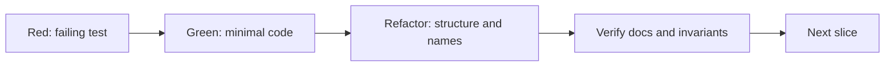
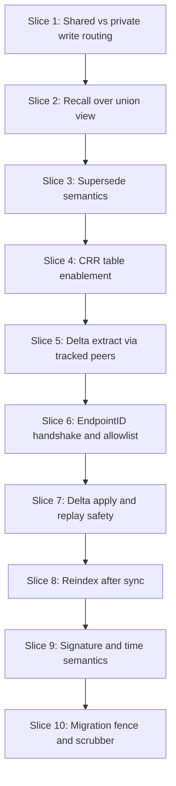

# TDD Workflow

Status: Draft v0.3
Date: 2026-03-10

## 1. Development Rule

このプロジェクトの TDD は「抽象クリーン設計」ではなく「vertical slice を最小単位にした実用 TDD」を採る。

原則:

- 1 slice = 1 user-visible behavior
- 先に failing test を書く
- implementation は最短で通す
- refactor は public behavior を増やさずに行う
- slice 完了ごとに architecture docs と差分がないか確認する

## 2. TDD Loop



## 3. Slice Order



## 4. Slice Details

### Slice 1: shared vs private write routing

First failing tests:

- stores shared memory in shared table family
- stores private memory in private table family
- rejects invalid visibility or empty body

Minimal implementation:

- SQLite schema for both table families
- repository routing
- API handler/service method

Done when:

- one integration test proves private data never lands in shared tables

### Slice 2: `Recall` over union view

First failing tests:

- query matches FTS5-backed memory
- recall returns top-k and source metadata
- recall can include shared and private families from one API

Minimal implementation:

- recall union view
- FTS5 virtual table
- lexical recall query
- result shaping

Done when:

- top-k lexical recall works without vectors

### Slice 3: `SupersedeMemory`

First failing tests:

- supersede creates new memory row
- old row becomes `superseded`
- relation `supersedes` is created

Minimal implementation:

- service method
- transactional repository call

Done when:

- no semantic body overwrite path remains in write API

### Slice 4: CRR table enablement

First failing tests:

- shared tables are marked as CRR successfully
- regular tables remain absent from `crsql_changes`

Minimal implementation:

- migration for CRR enablement
- adapter method for extension bootstrap

Done when:

- `memory_nodes` changes appear in `crsql_changes`
- `private_memory_nodes` and `memory_embeddings` changes do not

### Slice 5: delta extract via tracked peers

First failing tests:

- returns only rows after watermark
- excludes private table family entirely
- serializes changes into deterministic wire format

Minimal implementation:

- query builder for `crsql_changes`
- tracked peer cursor integration
- outbound batch encoder

Done when:

- same DB state produces deterministic outbound batch for the same tracked cursor

### Slice 6: EndpointID handshake and allowlist

First failing tests:

- rejects unknown peer
- rejects schema hash mismatch
- accepts known peer and returns negotiated params
- treats invite ticket as first-contact only and persists EndpointID

Minimal implementation:

- peer policy repository
- handshake request/response structs
- Iroh stream adapter

Done when:

- no data apply occurs before successful handshake
- subsequent reconnects use EndpointID without requiring fresh ticket

### Slice 7: Delta apply and replay safety

First failing tests:

- applying the same batch twice is safe
- apply failure does not corrupt watermark
- incompatible batch goes to quarantine

Minimal implementation:

- apply transaction
- watermark update sequencing
- quarantine handling

Done when:

- replay safety integration test is green

### Slice 8: Reindex after sync

First failing tests:

- changed memory IDs are queued after apply
- FTS and embeddings rebuild only for changed IDs

Minimal implementation:

- changed-row collector
- index queue
- worker processing loop

Done when:

- sync apply makes remote memory searchable locally

### Slice 9: signature and time semantics

First failing tests:

- canonical payload serialization is deterministic
- signature verification succeeds across peers
- authored clock skew does not alter sync convergence

Minimal implementation:

- canonical payload encoder
- signer/verifier
- time-aware ranking rules

Done when:

- signatures validate immutable claims without owning mutable lifecycle state

### Slice 10: migration fence and scrubber

First failing tests:

- detects orphan edges
- detects missing artifact bodies
- suggests repair actions without destructive mutation
- fences shared sync on schema drift

Minimal implementation:

- scrubber queries
- migration compatibility checker
- repair report model

Done when:

- operator can inspect data health and schema compatibility locally

## 5. Test Directory Guidance

Suggested layout:

```text
/internal/memory/...
/internal/sync/...
/internal/index/...
/internal/policy/...
/test/unit/...
/test/integration/...
/test/e2e/...
```

## 6. Refactor Rules

- refactor after green, not before
- move code only when a second use appears
- avoid introducing generic abstractions for a single adapter
- preserve deterministic test seams: clock, ID generator, signer, embedding model, transport

## 7. Definition Of Done Per PR

- relevant slice tests are red then green in commit history or local workflow
- docs remain consistent with implementation
- no new public behavior ships without integration coverage
- log and metric hooks exist for new failure modes

## 8. Anti-Patterns

- starting with transport before local write path exists
- sharing embeddings before local reindex path is stable
- adding partial sync before whole namespace sync is proven
- relying on DB foreign keys that CRR tables cannot enforce
- hiding semantic overwrite inside update statements
- storing private structured memory in shared CRR tables
- treating invite tickets as long-lived peer identity

## 9. First Three PRs

### PR 1

- local schema
- shared/private routing
- FTS recall baseline

### PR 2

- `SupersedeMemory`
- signal model
- artifact trace basics

### PR 3

- CRR enablement
- tracked-peer cursor integration
- inbound apply and replay safety
