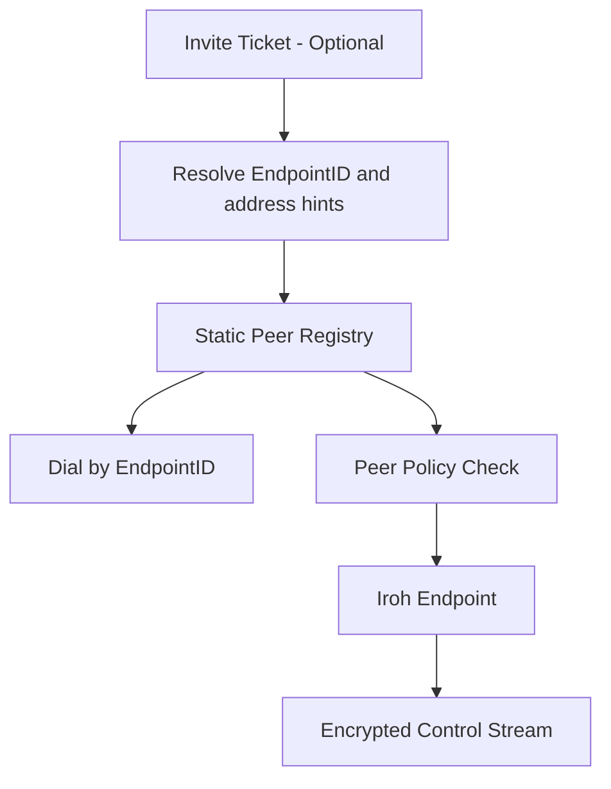
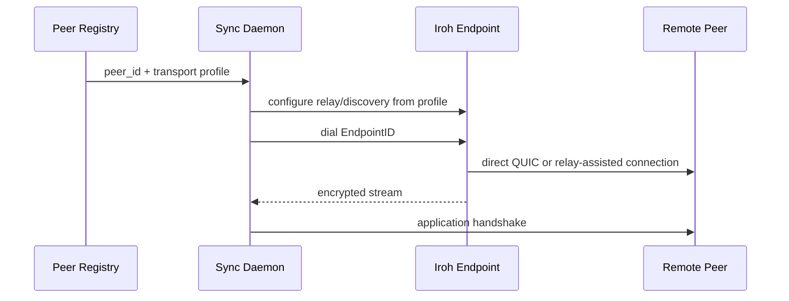

# Transport And Bootstrap

Status: Draft v0.3
Date: 2026-03-10

## 1. Purpose

この文書は、Iroh を transport としてどう使うか、どこで使わないか、どの bootstrap 手順を既定にするかを定義する。

## 2. Primary-Source Facts

- Iroh の stable identity は public-key-based `NodeId` / `EndpointId`
- tickets は convenience pattern であり、中央 coordination があるなら `NodeId` を直接使う方がよい
- relay は direct connection を補助するもので、source of truth ではない
- local discovery は default off で opt-in
- endpoint builder は discovery や relay を明示設定できる

Sources:

- https://docs.iroh.computer/concepts/identifiers
- https://docs.iroh.computer/concepts/tickets
- https://docs.iroh.computer/concepts/relays
- https://www.iroh.computer/docs/concepts/local_discovery
- https://docs.rs/iroh/latest/iroh/endpoint/struct.Builder.html

## 3. Default Profiles

まず分けて考える。

- Iroh general defaults: library が用意する一般既定
- product transport policy: このプロダクトが production で採る制約

### Development Profile

- bootstrap: static peer list or invite ticket
- discovery: default DNS discovery may be allowed
- relay: default/public relay may be allowed
- mDNS/local discovery: enabled on trusted LAN when useful

### Production Profile

- bootstrap: static peer registry keyed by `EndpointID`
- discovery: explicit configuration only
- relay: explicit relay set only
- tickets: onboarding only
- local discovery: disabled unless deployment is LAN-only and approved
- if discovery is disabled, peer registry must carry usable address or relay hints

Inference:

- `EndpointID` を長期 peer identity にし、ticket は初回招待 artefact として扱うのが運用上安定する

## 4. Bootstrap Model

peer registry fields:

- `peer_id` as `EndpointID`
- `display_name`
- `namespace_allowlist`
- `relay_profile`
- `discovery_profile`
- `last_known_addrs`
- `last_known_relay`
- `invite_ticket_last_seen` optional

Note:

- `EndpointID` is the stable identity
- address hints and relay hints are transport hints, not identity

## 5. Connection Flow

## 6. Discovery Policy

| Discovery mechanism | MVP status | Default |
| --- | --- | --- |
| Static peer registry keyed by `EndpointID` | required | on |
| Invite tickets | supported for onboarding | manual only |
| DNS discovery | supported by Iroh | dev yes, prod explicit only |
| mDNS/local discovery | supported by Iroh with opt-in | off by default |

## 7. Relay Policy

- relay is connectivity infrastructure, not application state
- relay URLs must be config-owned in production
- default/public relays may be acceptable in development
- direct path is preferred when established

## 8. Allowlist Boundary

transport acceptance and application sync authorization are related but separate.

- `EndpointID` allowlist decides whether we will attempt sync
- application handshake decides namespace compatibility and schema compatibility
- unauthorized peer must not reach delta apply

## 9. Explicit Non-Goals

- live remote query forwarding over Iroh
- making relay hold authoritative memory state
- treating invite tickets as long-term peer identifiers
