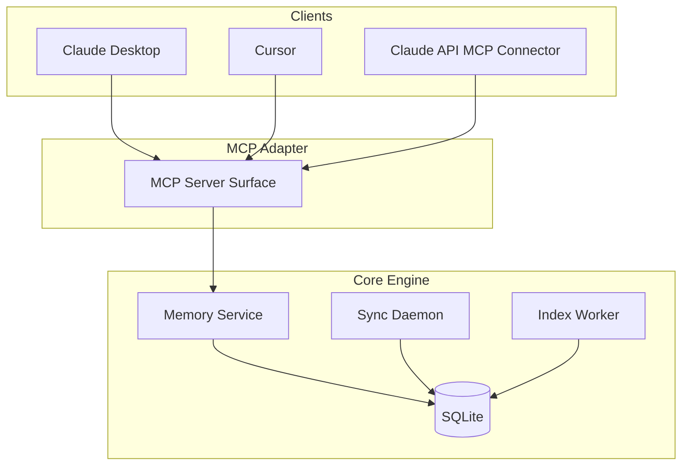

# MCP Integration

Status: Draft v0.1
Date: 2026-03-10

## 1. Judgment

MCP はこのプロジェクトにかなり自然に入る。

ただし位置づけは明確にする。

- MCP is adapter, not core
- core behavior is owned by `memory service`
- client-specific transport differences are absorbed by the MCP layer

## 2. Primary-Source Grounding

### MCP specification

- standard transports are `stdio` and `Streamable HTTP`
- clients SHOULD support `stdio` whenever possible

Source:

- https://modelcontextprotocol.io/specification/2025-06-18/basic/transports

### Cursor

- Cursor docs describe MCP support for `stdio`, `SSE`, and `Streamable HTTP`
- docs also describe support for tools, prompts, resources, roots, and elicitation

Source:

- https://docs.cursor.com/en/context/mcp

### Claude API MCP connector

- Messages API can connect to remote MCP servers
- current support is tools only
- requires a publicly exposed HTTP server

Source:

- https://platform.claude.com/docs/en/agents-and-tools/mcp-connector

### Claude ecosystem

- Anthropic docs cover both local and remote MCP
- Claude Desktop ecosystem supports local desktop extensions
- MCPB local extensions are stdio-based and offline-first
- Claude Code docs show `type: "stdio"` style MCP configuration

Sources:

- https://claude.com/docs/connectors/building/mcp
- https://support.claude.com/en/articles/12922929-building-desktop-extensions-with-mcpb
- https://docs.claude.com/en/docs/claude-code/mcp

## 3. Practical Conclusion

あなたの整理にはほぼ賛成です。ただし、少しだけ精密に言い換えるべきです。

正しい部分:

- 既存 client に繋ぐなら MCP adapter は best-practice 寄り
- Go core engine の上に MCP surface を載せるのは自然
- `pnpm install` を必須にしない Go binary 配布は有力
- Claude Desktop / Cursor 向けには stdio first が現実的

注意が必要な部分:

- `http://localhost:8080/mcp` が全クライアントの共通最適解ではない
- Claude API connector は local stdio ではなく public HTTP 前提
- Cursor は stdio も HTTP も扱える
- Claude Desktop 系は local stdio と相性が良い

## 4. Architecture Position



## 5. Recommended MVP Strategy

### Phase 1

- implement MCP adapter
- transport: `stdio`
- exposed surface: tools only
- target clients: Claude Desktop, Cursor

### Phase 2

- add `Streamable HTTP`
- target clients: Cursor remote config, Claude API connector
- add auth and origin validation

### Phase 3

- evaluate resources/prompts exposure
- optionally add MCPB packaging for Claude Desktop distribution

## 6. Why `stdio` First

理由:

- MCP spec の標準 transport
- local-first な導入に向く
- Go binary をそのまま subprocess として配れる
- Claude Desktop 系と相性が良い
- localhost HTTP の auth/origin 問題を最初から抱えなくてよい

## 7. Why `Streamable HTTP` Second

必要になる場面:

- remote-hosted MCP server
- Claude API connector
- Cursor の URL-based integration

必要な追加項目:

- auth
- origin validation
- bind policy
- session handling
- remote exposure policy

## 8. Tools-First Surface

MVP で出すべき tools:

- `memory.store`
- `memory.recall`
- `memory.supersede`
- `memory.signal`
- `memory.trace_decision`
- `memory.explain`
- `memory.sync_status`

理由:

- Claude API connector は現時点で tools only
- tools は Claude Desktop / Cursor でも最も実用的
- core API と 1 対 1 で結びやすい

## 9. Resources And Prompts

MVP では second step にする。

理由:

- client support に差がある
- 最初に価値が出るのは tools
- resources は後から read-only view として追加しやすい

候補:

- `memory://namespace/team-dev/recent`
- `memory://decision/{id}`
- `memory://sync/status`

## 10. Client-Specific Guidance

### Claude Desktop

- first-class target
- `stdio` first
- Go binary 配布に向く

### Cursor

- first-class target
- `stdio` first
- HTTP is later

### Claude API MCP Connector

- not first MVP target
- tools only
- public HTTP required
- better as Phase 2

## 11. Example Mental Models

### Claude Desktop / local mode

```json
{
  "mcpServers": {
    "group-memory": {
      "type": "stdio",
      "command": "/usr/local/bin/memory-mcp",
      "args": ["serve", "--config", "/path/to/config.yaml"]
    }
  }
}
```

### Cursor mode

- local stdio command
- or later, URL-based HTTP transport

## 12. Final Recommendation

- MCP is adapter, not core
- MVP transport is `stdio`
- optional second transport is `Streamable HTTP`
- MVP surface is tools first
- primary existing-client targets are Claude Desktop and Cursor
- Claude API connector is a second-phase target

