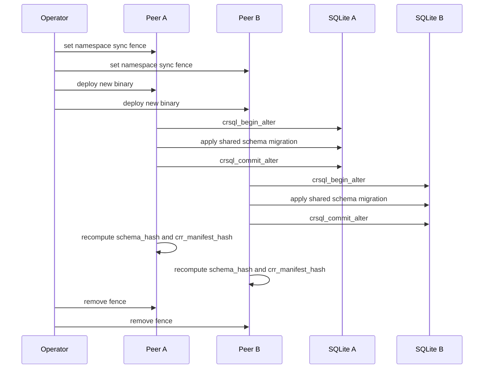
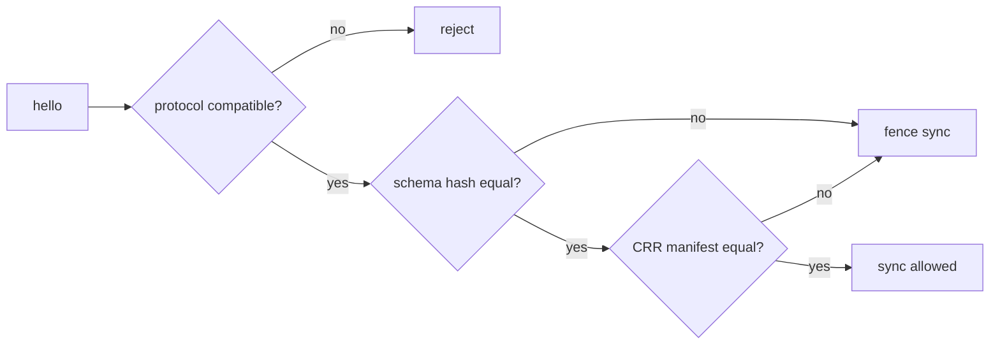

# Migration And Compatibility

Status: Draft v0.3
Date: 2026-03-10

## 1. Purpose

この文書は、CRR schema の migration、互換性判定、rolling upgrade の安全限界を定義する。

## 2. Primary-Source Facts

- `crsql_begin_alter` / `crsql_commit_alter` が CRR table migration 用に提供されている
- two CRRs must have the same schema and same set of CRRs to sync
- `crsql_tracked_peers` は custom syncing layer の last synced point 用である

Sources:

- https://vlcn.io/docs/cr-sqlite/advanced/migrations
- https://www.vlcn.io/docs/cr-sqlite/networking/whole-crr-sync

## 3. Compatibility Contract

共有同期に必要な一致条件:

- `protocol_version` compatible
- `min_compatible_protocol_version` satisfied
- `schema_hash` equal
- `crr_manifest_hash` equal

Definitions:

- `schema_hash`: shared CRR schema の hash
- `crr_manifest_hash`: CRR 化された table set の hash

重要:

- mixed shared schema peers は transport 接続できても shared sync はしてはいけない

## 4. Migration Classes

| Class | Example | Can mixed-version peers sync? | Policy |
| --- | --- | --- | --- |
| Local-only migration | `peer_sync_state` column add | yes | online |
| Shared CRR additive migration | `memory_nodes` new column add | no in MVP | fence shared sync until cluster match |
| Shared CRR breaking migration | rename/remove/change semantic fields | no | planned migration window only |

Inference:

- `cr-sqlite` が same schema を要求する以上、shared CRR changes を mixed cluster で安全運用するのは MVP の目標外とするのが堅い

## 5. Rolling Upgrade Rule

rolling binary upgrade は可能だが、rolling shared schema migration は limited である。

- binary-only upgrade with same shared schema: allowed
- local-only schema migration: allowed
- shared CRR schema migration: sync fenced until all relevant peers match

## 6. Upgrade Sequence

## 7. Runtime Handshake Rules

## 8. Migration Checklist

Before migration:

- backup local SQLite file
- mark affected shared namespaces fenced
- ensure no pending destructive repair jobs

During migration:

- use `crsql_begin_alter`
- apply all shared table changes
- use `crsql_commit_alter`
- verify `crsql_tracked_peers` preserved
- do not rely on dev-only migration helpers as a production safety story

After migration:

- recompute `schema_hash`
- recompute `crr_manifest_hash`
- run scrubber
- run replay-safety and sync-smoke tests

## 9. Field Design Guidance

To reduce painful migrations:

- avoid renaming shared columns in MVP
- avoid changing signed canonical payload semantics casually
- prefer additive new tables or new optional fields over overloaded mutable columns
- keep attachment replication concerns outside shared CRR schema

## 10. What To Document In Code

- migration ID
- binary version
- protocol version
- min compatible protocol version
- schema hash
- CRR manifest hash

## 11. Explicit Non-Goals

- zero-downtime shared schema drift across mismatched peers
- automatic cross-version translation of shared CRR payloads in MVP
