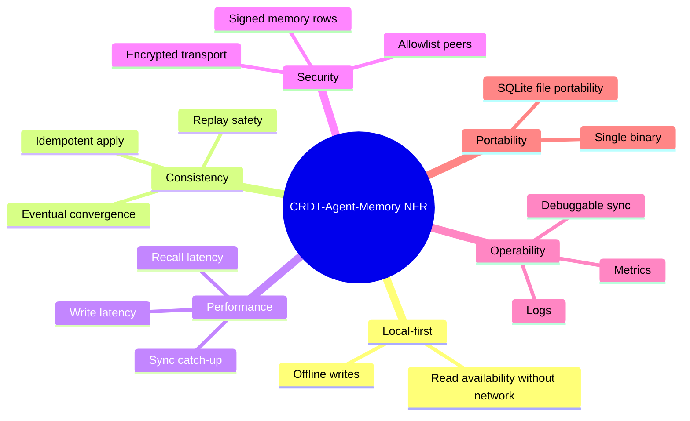

# Non-Functional Requirements

Status: Draft v0.2
Date: 2026-03-10

## 1. Scope

この文書は CRDT-Agent-Memory の品質属性、運用制約、セキュリティ要件、性能目標を定義する。

## 2. Assumptions

- MVP 規模は 2 から 10 peer
- 1 namespace あたり 100,000 memory items までを初期想定
- attachment 本体は SQLite 外に置く
- recall は peer 間問い合わせではなくローカル完結

## 3. NFR Mindmap

## 4. Quality Attribute Requirements

| ID | Requirement | Target |
| --- | --- | --- |
| NFR-001 | Local write must succeed without network | 100 percent of writes when local DB is healthy |
| NFR-002 | Recall must work offline | all read APIs operate from local DB only |
| NFR-003 | Eventual convergence for connected peers | same namespace converges after connectivity resumes |
| NFR-004 | Delta apply must be idempotent | replaying the same batch produces no semantic duplicate rows |
| NFR-005 | Local write latency | p95 under 30 ms for single memory write without embedding |
| NFR-006 | Recall latency | p95 under 250 ms for top-k recall over 100k memories on target hardware |
| NFR-007 | LAN catch-up sync latency | 10k changed rows converge within 60 s on LAN baseline |
| NFR-008 | WAN catch-up sync latency | 10k changed rows converge within 5 min on relay-assisted path |
| NFR-009 | Memory durability | no acknowledged write lost after local fsync-capable commit |
| NFR-010 | Transport confidentiality | all peer traffic encrypted in transit |
| NFR-011 | Peer authentication | only allowlisted peers may sync |
| NFR-012 | Source traceability | every shared decision memory should link to source or rationale |
| NFR-013 | Upgrade safety | schema mismatch must fail closed, not partially sync |
| NFR-014 | Observability | sync failures and lag are inspectable locally |
| NFR-015 | Portability | node can migrate by moving binary, config, and SQLite file |

## 5. Quality Attribute Scenarios

### 5.1 Offline Write Scenario

- Given: network unavailable for 8 hours
- When: agent writes 500 new memories
- Then: all writes succeed locally
- And: reconnect later triggers catch-up sync without manual repair

### 5.2 Replayed Batch Scenario

- Given: a peer resends the same changeset after timeout
- When: receiver applies the batch twice
- Then: semantic state remains unchanged
- And: no extra `memory_nodes` rows are created solely due to replay

### 5.3 Mismatched Schema Scenario

- Given: peer A and peer B have different `schema_hash`
- When: they establish transport
- Then: handshake stops before data apply
- And: an operator-visible error is recorded

### 5.4 Corrupt Attachment Reference Scenario

- Given: `artifact_ref` points to a missing local file
- When: recall uses that memory
- Then: recall still returns the memory
- And: source access is marked degraded

## 6. Security Requirements

| ID | Requirement | Design response |
| --- | --- | --- |
| SEC-001 | peer identity must be cryptographically bound | Ed25519 peer IDs and row signatures |
| SEC-002 | network transport must be encrypted | Iroh encrypted QUIC streams |
| SEC-003 | unauthorized peers must be rejected before sync | allowlist and handshake auth |
| SEC-004 | remote memories must not be trusted equally | local trust weights and peer policies |
| SEC-005 | prompt injection from remote summaries must be contained | retrieval marks provenance and trust tier |
| SEC-006 | private memory must never leak | `scope='private'` filtered at sync daemon |

## 7. Reliability Requirements

| ID | Requirement | Measure |
| --- | --- | --- |
| REL-001 | sync daemon recovers from transient transport loss | automatic backoff and retry |
| REL-002 | apply failure is isolated | quarantine failed batch and continue other peers |
| REL-003 | orphan references are discoverable | scrubber detects and reports orphan rate |
| REL-004 | long-lived nodes remain maintainable | compaction and summary generation jobs bound storage growth |

## 8. Performance Budgets

### Write Path

- base SQLite write: under 10 ms p95
- relation + signal inserts: under 20 ms additional p95
- embedding generation excluded from synchronous request budget

### Sync Path

- handshake: under 1 s p95 on reachable peer
- batch serialization: under 100 ms per 10k row delta batch
- local apply: under 2 s per 10k row batch on baseline hardware

### Recall Path

- candidate generation: under 100 ms p95
- graph/trust rerank: under 100 ms p95
- trace assembly: under 50 ms p95

## 9. Operational Requirements

| ID | Requirement | Implementation hint |
| --- | --- | --- |
| OPS-001 | local metrics endpoint | expose sync lag, queue depth, orphan rate |
| OPS-002 | structured logs | peer_id, namespace, batch_id, error_code |
| OPS-003 | local diagnostics command | dump schema hash, watermarks, pending jobs |
| OPS-004 | safe startup checks | migrate local tables before daemon start |
| OPS-005 | safe shutdown | flush in-flight watermark updates |

## 10. Capacity Guardrails

- one node should operate within 1 GB DB size for initial MVP target
- one recall should inspect at most 1,000 candidate rows before rerank
- one sync batch should cap at configurable row and byte limits
- attachment bodies must not be stored in CRR tables

## 11. Explicit Non-Goals

- active-active strong consistency
- public anonymous mesh participation
- shared ANN index across peers
- attachment body replication guarantees in MVP

## 12. Release Gates

- all NFR-001 through NFR-006 must pass before Phase 1 release
- all SEC requirements must pass before non-local peer rollout
- REL-001 through REL-003 must pass before dogfooding with more than 2 peers

