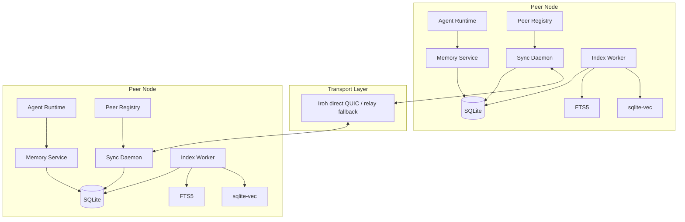

# Technology Decisions And Responsibility Boundaries

Status: Draft v0.3
Date: 2026-03-10

## 1. Decision Summary

MVP の判断は次で固定する。

- Keep: `Go + SQLite + cr-sqlite + crsql_tracked_peers + Iroh + FTS5 + sqlite-vec + Ed25519`
- Change from v0.2:
  - private structured memory is no longer stored in shared CRR tables
  - shared sync cursors use `crsql_tracked_peers` as the primary source of truth
  - bootstrap defaults are EndpointID-centric, not ticket-centric
  - migration and compatibility policy is explicit and fail-closed
- Defer: partial sync, public discovery, cloud-primary topology, shared embeddings, rich ACL
- Reject for MVP core: PowerSync as source-of-truth sync engine, Ditto as the core substrate, SQLite Sync as the main dependency, Veilid as the first transport

## 2. Primary-Source Verified Facts

| Claim | What it means for design | Source |
| --- | --- | --- |
| `cr-sqlite` lets you make selected tables syncable and keep other tables regular | 同じ DB 内で shared tables と local-only tables を分離できる | https://vlcn.io/docs/cr-sqlite/quickstart |
| `crsql_changes` is the interface for reading and applying changes | 同期の wire payload は DB 全体ではなく changeset batch でよい | https://vlcn.io/docs/cr-sqlite/quickstart |
| `whole CRR sync` is documented as the most tested and performant model | MVP は namespace 単位 whole sync を選ぶのが妥当 | https://www.vlcn.io/docs/cr-sqlite/networking/whole-crr-sync |
| Two CRRs must have the same schema and same set of CRRs to sync | shared schema mismatch 時は fail-closed にするしかない | https://www.vlcn.io/docs/cr-sqlite/networking/whole-crr-sync |
| `crsql_tracked_peers` is provided for custom syncing layers to remember the last synced point for a peer | cursor を自前実装しきる必要はない。built-in を正本にするべき | https://www.vlcn.io/docs/cr-sqlite/networking/whole-crr-sync |
| CRR tables cannot use checked foreign keys or non-PK unique constraints | ERD はアプリ整合性と scrubber 前提で設計する必要がある | https://www.vlcn.io/docs/cr-sqlite/constraints |
| `crsql_begin_alter` / `crsql_commit_alter` exist for schema alterations on CRR tables | migration policy を docs に明記する必要がある | https://vlcn.io/docs/cr-sqlite/advanced/migrations |
| Iroh provides encrypted QUIC connections, direct connections, and relay fallback | NAT 越えや暗号 transport を自前実装しなくてよい | https://www.iroh.computer/docs/overview and https://docs.iroh.computer/concepts/relays |
| Iroh node identifiers are `NodeId` / `EndpointId` values based on public keys | stable peer identity を EndpointID に固定できる | https://docs.iroh.computer/concepts/identifiers |
| Iroh tickets are a convenience pattern; if you have central coordination or a directory, use `NodeId` directly | ticket を primary identity にしない方がよい | https://docs.iroh.computer/concepts/tickets |
| mDNS/local discovery is not enabled by default and must be explicitly configured | mDNS を開発/LAN 専用の opt-in にできる | https://www.iroh.computer/docs/concepts/local_discovery |
| The default endpoint builder enables discovery; explicit builders allow turning features off | production では discovery/relay を明示設定に寄せるべき | https://docs.rs/iroh/latest/iroh/endpoint/struct.Builder.html |
| `sqlite-vec` is pre-v1 and is presented as the successor direction to `sqlite-vss` | 共有本体ではなく再生成可能な local index に閉じるべき | https://github.com/asg017/sqlite-vec and https://github.com/asg017/sqlite-vss |
| PowerSync centers on syncing backend databases such as Postgres to client-side SQLite | authoritative backend 前提なので純 P2P の核には向かない | https://www.powersync.com/sync-postgres |
| Ditto positions itself as edge sync with built-in connectivity and mesh replication | 市場成立性の証拠にはなるが、SQLite 中核の memory substrate とは違う | https://docs.ditto.live/home/about-ditto |
| SQLite Sync is under Elastic License 2.0 and calls out commercial licensing for production/managed service use | MVP コア依存にするとライセンス面の制約を背負う | https://github.com/sqliteai/sqlite-sync |

## 3. Responsibility Matrix

| Technology | Use it for | Do not use it for | Why |
| --- | --- | --- | --- |
| Go | memory service, sync daemon, workers, API orchestration | heavy analytics, ad-hoc notebooking | 長期運用する daemon の実装と配布がしやすい |
| SQLite | canonical storage for structured memory and local state | cross-node consensus | local-first に最も自然 |
| cr-sqlite | shared CRR tables, delta extraction, delta apply | private memory, vector sharing, trust policy | 同期対象をテーブル単位で限定できる |
| `crsql_tracked_peers` | last-synced cursor for shared peers | transport diagnostics, retry metrics | cursor の正本を built-in に寄せられる |
| Iroh | encrypted transport, EndpointID, relay-assisted connectivity | schema validation, conflict resolution | transport と sync semantics を分離できる |
| FTS5 | lexical retrieval, keyword filters, explainability support | semantic truth | SQLite への統合が軽い |
| sqlite-vec | local semantic recall accelerator | shared canonical state | pre-v1 なので派生物に閉じるべき |
| Ed25519 | peer identity, signatures, allowlist, trust binding | content ranking by itself | transport identity と署名検証の軸になる |

## 4. Where Each Technology Is Explicitly Discarded

### 4.1 cr-sqlite

使う場所:

- `memory_nodes`
- `memory_edges`
- `memory_signals`
- `artifact_refs`
- `artifact_spans`

捨てる場所:

- `private_memory_nodes`
- `private_memory_edges`
- `private_memory_signals`
- `private_artifact_refs`
- `private_artifact_spans`
- `memory_embeddings`
- `peer_sync_state`
- `peer_policies`
- attachment 本体

理由:

- CRR に入った row は sync concern から完全には切り離せない
- private data は物理分離した方が安全
- 派生索引はモデル変更で簡単に invalid になる

### 4.2 `crsql_tracked_peers`

使う場所:

- peer ごとの last-synced cursor
- outbound changeset extraction の起点
- inbound apply 後の cursor 更新

捨てる場所:

- `last_seen_at_ms`
- `last_error`
- transport path diagnostics
- trust state

理由:

- built-in cursor と app-specific metadata は責務が違う

### 4.3 Iroh

使う場所:

- control stream
- changeset data streams
- relay fallback
- EndpointID-based peer dialing

捨てる場所:

- data model
- version vectors
- trust policy
- query protocol semantics

理由:

- Iroh は transport であって DB ではない
- 接続問題と同期意味論を混ぜると設計が鈍る

### 4.4 sqlite-vec

使う場所:

- local recall acceleration
- optional hybrid ranking
- re-embedding after sync apply

捨てる場所:

- cross-node replication payload
- audit log
- source-of-truth storage

理由:

- モデル、次元、index layout が変わりやすい
- 同じテキストでも埋め込み互換性が保証されない

## 5. Recommended MVP Architecture

## 6. Alternatives And Why They Are Not Default

| Option | When it becomes attractive | Why it is not the default |
| --- | --- | --- |
| Veilid | privacy-first public overlay, stronger overlay anonymity requirements | MVP の transport としては責務が重い |
| Ditto | commercial edge sync, mobile-heavy deployment, attachments first | SQLite 中核と OSS 主導の substrate から離れる |
| PowerSync | server-centric SaaS, authoritative Postgres backend | 純 P2P ではなく中央 source-of-truth 前提 |
| SQLite Sync | rapidly testing a CRDT SQLite extension with built-in networking | ライセンス制約が重く、コア依存に向かない |
| libSQL/Turso | cloud-optional hub, analytics node, remote backup | MVP の canonical P2P memory fabric ではない |

## 7. Cursor And Bootstrap Defaults

### 7.1 Cursor authority

- shared sync cursor truth: `crsql_tracked_peers`
- supplemental metadata: `peer_sync_state`
- no duplicated watermark logic in app code unless extension data is insufficient

### 7.2 Bootstrap defaults

- production default identity: static peer registry keyed by `EndpointID`
- ticket usage: manual invite and first-contact convenience only
- mDNS/local discovery: development or trusted LAN only
- public/shared DNS discovery and public relays: development default only
- production transport profile: explicit relay set and explicit discovery configuration

Inference:

- `EndpointID` を stable identity にし、ticket は bootstrap artifact として扱う方が長期 peer 関係に向く

## 8. Architectural Non-Negotiables

- shared truth is structured shared memory, not embeddings
- private structured memory never enters shared CRR tables
- all sync payloads must be replay-safe and idempotent
- overwrite of semantic content must be replaced by append-plus-supersede
- relay must not become a hidden source of truth
- shared sync must fail closed on schema mismatch

## 9. Source Links

- https://vlcn.io/docs/cr-sqlite/quickstart
- https://www.vlcn.io/docs/cr-sqlite/networking/whole-crr-sync
- https://www.vlcn.io/docs/cr-sqlite/constraints
- https://vlcn.io/docs/cr-sqlite/advanced/migrations
- https://www.iroh.computer/docs/overview
- https://docs.iroh.computer/concepts/identifiers
- https://docs.iroh.computer/concepts/tickets
- https://docs.iroh.computer/concepts/relays
- https://www.iroh.computer/docs/concepts/local_discovery
- https://docs.rs/iroh/latest/iroh/endpoint/struct.Builder.html
- https://github.com/asg017/sqlite-vec
- https://github.com/asg017/sqlite-vss
- https://www.powersync.com/sync-postgres
- https://docs.ditto.live/home/about-ditto
- https://github.com/sqliteai/sqlite-sync
