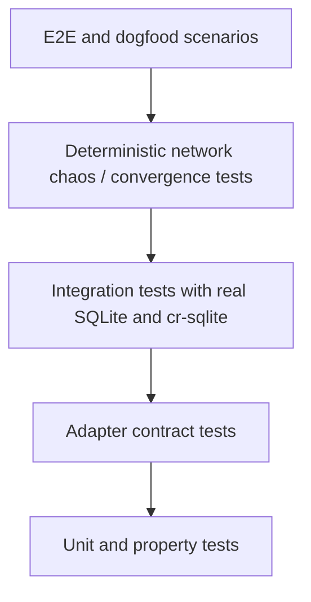
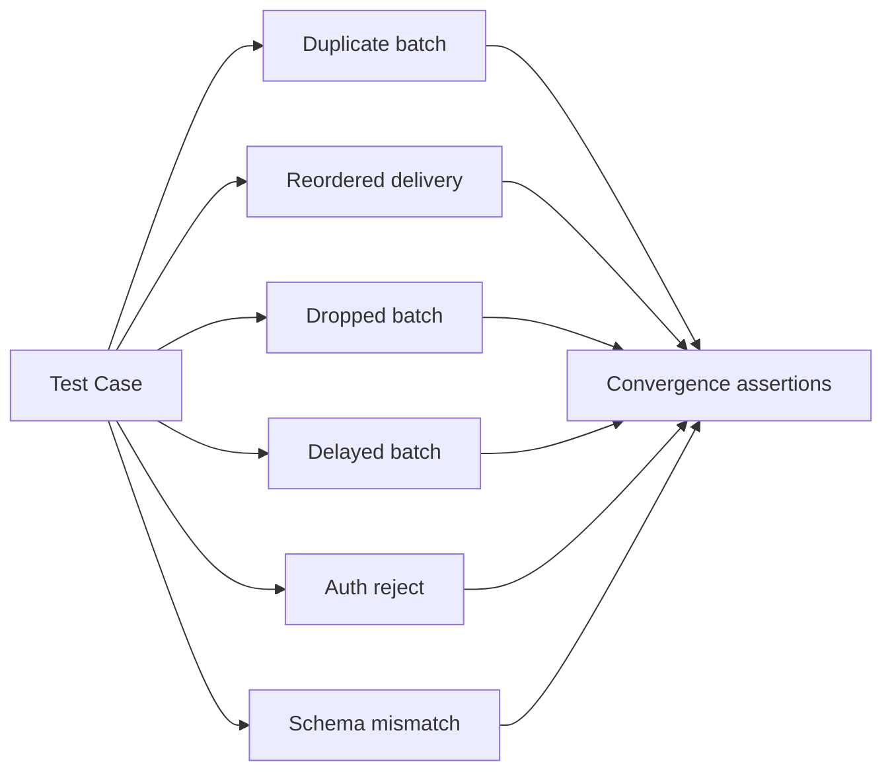

# Testing Strategy

Status: Draft v0.3
Date: 2026-03-10

## 1. Testing Goals

- data model の意味を守る
- sync の冪等性と収束性を守る
- recall の品質と説明可能性を守る
- transport failure と partial failure から復旧できることを守る

## 2. Test Pyramid

## 3. Test Layers

| Layer | Scope | Examples |
| --- | --- | --- |
| Unit | pure business rules | supersede rules, trust aggregation, query scoring |
| Property | invariants over generated inputs | replay safety, idempotence, order-independence expectations |
| Contract | adapter boundaries | SQLite repository, Iroh transport wrapper, signer |
| Integration | real DB and extension | `crsql_changes` pull/apply, FTS5 update, embedding rebuild queue |
| Deterministic chaos | controlled packet loss / duplicate / reorder | sync convergence with backoff and duplicate delivery |
| End-to-end | multi-process local mesh | 2-3 peers, actual recall correctness after sync |
| Performance | latency and throughput budgets | write p95, recall p95, 10k row sync apply |
| Security | authn/authz and provenance | allowlist rejection, signature failure, private-family leak checks |

## 4. Component-To-Test Mapping

| Component | Primary test types |
| --- | --- |
| Memory Service | unit, contract, integration |
| Sync Daemon | unit, contract, integration, chaos |
| SQLite adapter | contract, integration |
| Index Worker | unit, integration, performance |
| Scrubber Worker | unit, integration |
| Peer policy module | unit, security |

## 5. Deterministic Test Fixtures

- temporary SQLite file per test or per test cluster
- deterministic clock
- deterministic UUID/ULID generator in tests
- fake signer with reproducible keys
- fake embedding model for unit and most integration tests
- test transport harness for duplicate/delay/drop injection
- separate fixtures for shared and private table families

## 6. Core Invariants To Test

### Storage invariants

- `StoreMemory` never mutates existing semantic body in place
- `SupersedeMemory` produces a new row and marks the old row superseded
- private writes never enter shared CRR tables

### Sync invariants

- applying the same batch twice is a no-op semantically
- apply order variation converges to the same current state for supported cases
- schema mismatch causes fail-closed behavior
- unauthorized peer never reaches data apply
- `crsql_tracked_peers` remains the cursor truth after apply
- tests do not assume peer-side reconstruction of exact local transaction boundaries

### Retrieval invariants

- decision trace returns supporting or contradicting edges when present
- artifact trace survives missing attachment body
- trust weight affects rank but not raw storage state
- authored time skew does not affect sync convergence
- signature verification is based on canonical payload only

## 7. Required Integration Test Matrix

| Scenario | Real SQLite | Real cr-sqlite | Real Iroh | Notes |
| --- | --- | --- | --- | --- |
| local write/read | yes | no | no | Phase 0 base |
| CRR enablement and delta extraction | yes | yes | no | validate shared/local table split |
| delta apply and replay | yes | yes | no | same batch twice |
| handshake compatibility | yes | no | yes | schema hash, allowlist |
| end-to-end 2-peer sync | yes | yes | yes | whole namespace sync |
| relay-assisted sync | yes | yes | yes | when direct path unavailable |
| shared/private isolation | yes | yes | no | private families never appear in shared sync |
| migration fence | yes | yes | yes | shared sync blocked on schema drift |

## 8. Chaos And Failure Injection

failure cases:

- duplicate batch delivery
- partial batch apply failure
- relay path only
- peer disconnect between handshake and apply
- stale watermark resume
- missing artifact body
- clock skew across peers
- ticket-based first contact followed by EndpointID reuse

## 9. Performance Test Plan

| Benchmark | Target |
| --- | --- |
| single memory write, no embedding | p95 under 30 ms |
| top-k recall over 100k memories | p95 under 250 ms |
| 10k row delta extract | under 1 s |
| 10k row delta apply | under 2 s |
| reindex 1k changed memories | under 30 s |

## 10. CI Lanes

### Fast lane

- unit
- property
- contract

### Medium lane

- SQLite integration
- cr-sqlite integration
- API integration
- migration compatibility integration

### Slow lane

- multi-peer end-to-end
- relay-assisted path
- chaos
- performance smoke
- upgrade fence scenarios

## 11. Manual Dogfood Checklist

- two laptops on same team namespace
- one peer offline for several hours
- both peers write conflicting semantic updates via supersede, not overwrite
- reconnect and verify recall parity
- inspect sync logs and orphan rate
- verify private memories remain absent from peer B after multiple sync rounds

## 12. Exit Criteria By Phase

### Phase 0

- local write/read integration green
- recall correctness baseline green

### Phase 1

- two-peer sync green
- replay safety green
- schema mismatch fail-closed green
- shared/private isolation green

### Phase 2

- trust weighting green
- signed row verification green
- scrubber repair scenarios green
- rolling-upgrade fence scenarios green
