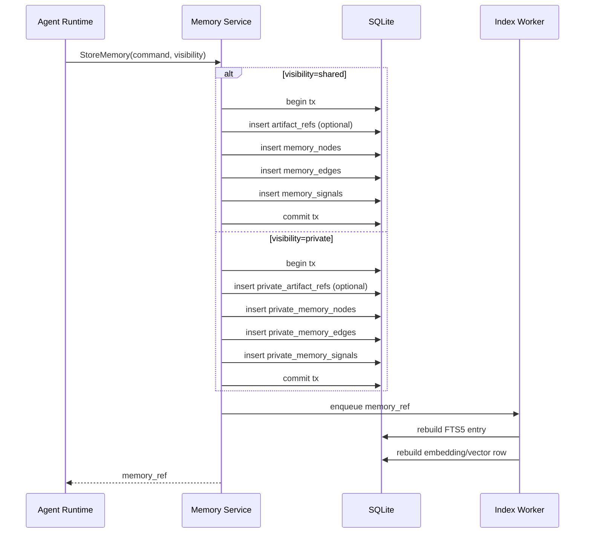
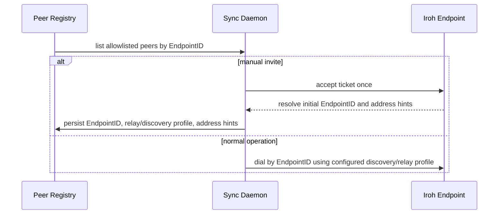
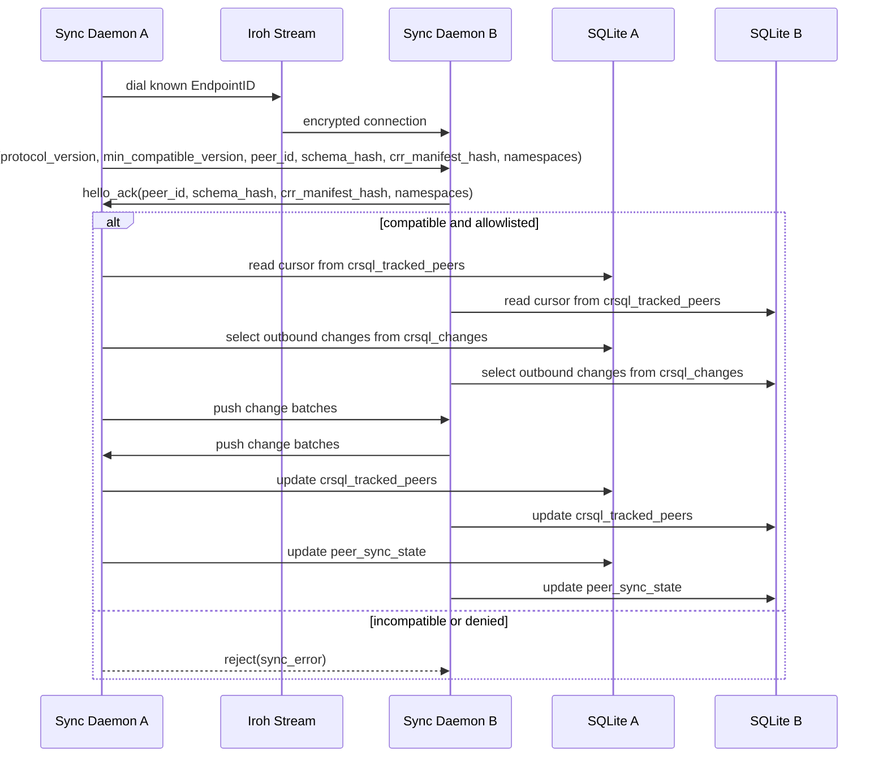
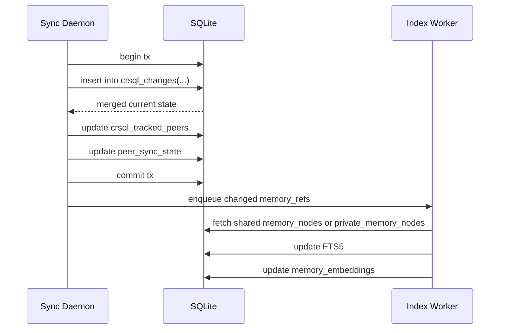
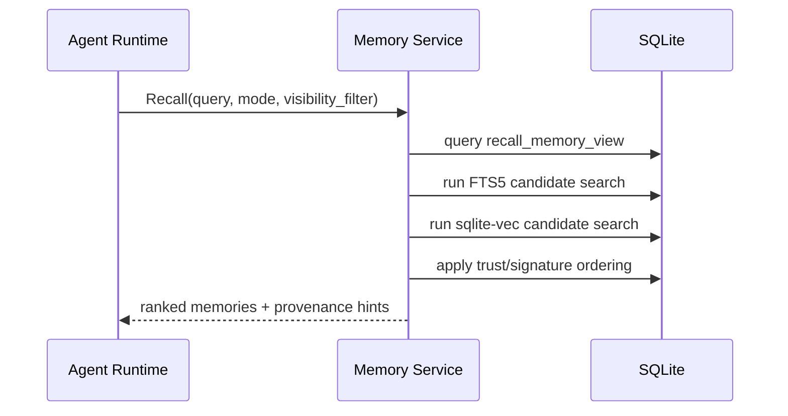
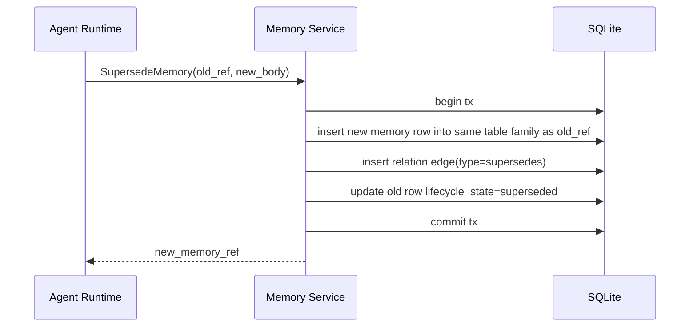
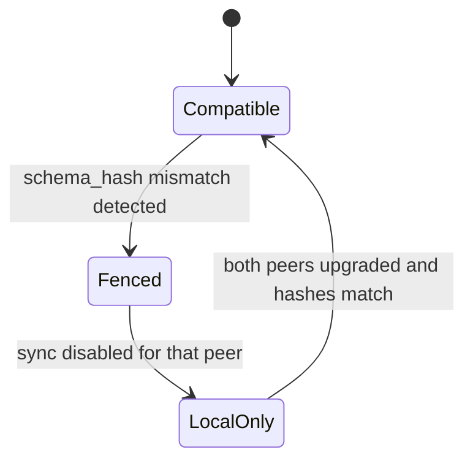
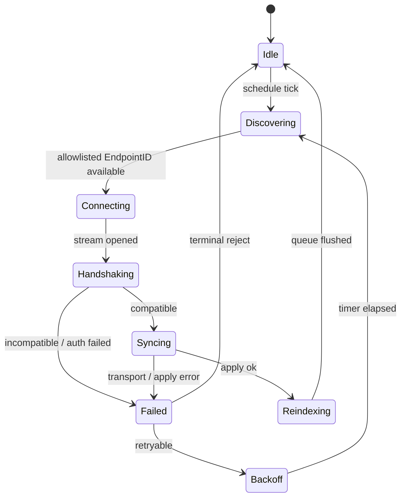

# Workflows

Status: Draft v0.3
Date: 2026-03-10

## 1. Components In Scope

- `Agent Runtime`
- `Memory Service`
- `SQLite`
- `Index Worker`
- `Sync Daemon`
- `Peer Registry`
- `Iroh Transport`
- `Remote Peer`

## 2. Workflow A: Local Memory Ingestion

目的:

- ローカルで記憶を作る
- 同期の有無に依存せず完結する
- shared/private を write 時点で分岐する

完了条件:

- shared request は shared table family にだけ書かれる
- private request は private table family にだけ書かれる
- index queue に対象が積まれている

ここでやらないこと:

- peer への直接送信
- embedding の共有
- trust policy の変更

## 3. Workflow B: Bootstrap And Peer Selection

目的:

- stable peer identity を `EndpointID` に固定する
- transport discovery と app allowlist を分離する

既定運用:

- production: static peer registry keyed by `EndpointID`
- tickets: first-contact only
- mDNS/local discovery: dev/LAN only
- public/shared discovery and relays: explicit opt-in outside development

## 4. Workflow C: Peer Handshake And Delta Sync

目的:

- peer identity を確認する
- protocol/schema compatibility を確認する
- `crsql_changes` の差分だけを送受信する

完了条件:

- allowlist で許可された peer だけが同期に進む
- `schema_hash` と `crr_manifest_hash` 不一致は即 reject
- 同期 payload は changeset batch のみ

ここでやらないこと:

- query API の中継
- vector blob の送信
- relay への永続保存

## 5. Workflow D: Change Apply And Local Reindex

目的:

- 受信差分を安全に適用する
- 必要な memory だけ再索引する

完了条件:

- `crsql_changes` 適用が冪等である
- reindex は changed memory のみ対象
- 受信順序が前後しても最終収束する

注意:

- local transaction atomicity は保たれても、peer 側で同じ transaction boundary が完全再現されるとは限らない
- `crsql_changes` は full immutable event log ではないため、sync worker は `1 command = 1 globally replayable transaction` を前提にしてはいけない
- command-level fidelity が必要な処理は app-owned outbound batch log を別で持つ

## 6. Workflow E: Recall And Decision Trace

目的:

- recall をローカル DB だけで完結させる
- shared/private の両方を一つの read API で扱う

ranking inputs:

- current: semantic similarity or lexical relevance
- current: trust weight
- current: signature bucket
- current: authored_at_ms
- planned: graph proximity
- planned: artifact-based reranking

重要:

- `authored_at_ms` は ranking hint と display 用であり、sync ordering truth ではない
- remote peer への live query は行わない
- graph / artifact 情報は `TraceDecision` で追跡できるが、`Recall` の現行 rerank にはまだ接続されていない

## 7. Workflow F: Memory Correction By Supersede

目的:

- semantic overwrite を避ける
- 履歴説明可能性を残す

設計意図:

- 古い memory を hard delete しない
- graph から更新関係を説明できる
- cell-wise merge に semantic overwrite を持ち込まない

## 8. Workflow G: Schema Upgrade Fence

目的:

- mixed schema peer のまま shared sync しない

運用ルール:

- local-only table migration は fence 不要
- shared CRR schema migration は sync fence 必須

## 9. Workflow H: Sync Retry And Backoff

retry policy:

- transport failure は exponential backoff
- schema mismatch は terminal reject until upgrade
- auth failure は terminal reject
- apply failure は quarantine queue に逃がす

## 10. Workflow Ownership Matrix

| Workflow | Main owner | Secondary owner |
| --- | --- | --- |
| Local ingestion | Memory Service | Index Worker |
| Bootstrap | Peer Registry | Sync Daemon |
| Peer handshake | Sync Daemon | Iroh transport wrapper |
| Change apply | Sync Daemon | SQLite adapter |
| Recall | Memory Service | Index Worker |
| Supersede | Memory Service | SQLite adapter |
| Upgrade fence | Sync Daemon | migration coordinator |
| Retry/backoff | Sync Daemon | peer policy module |
