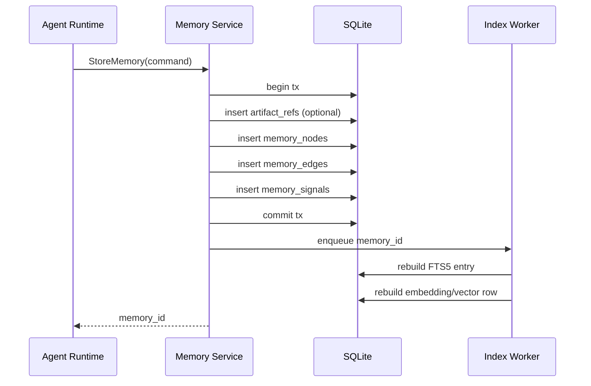
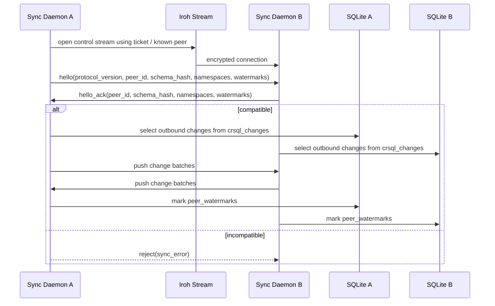
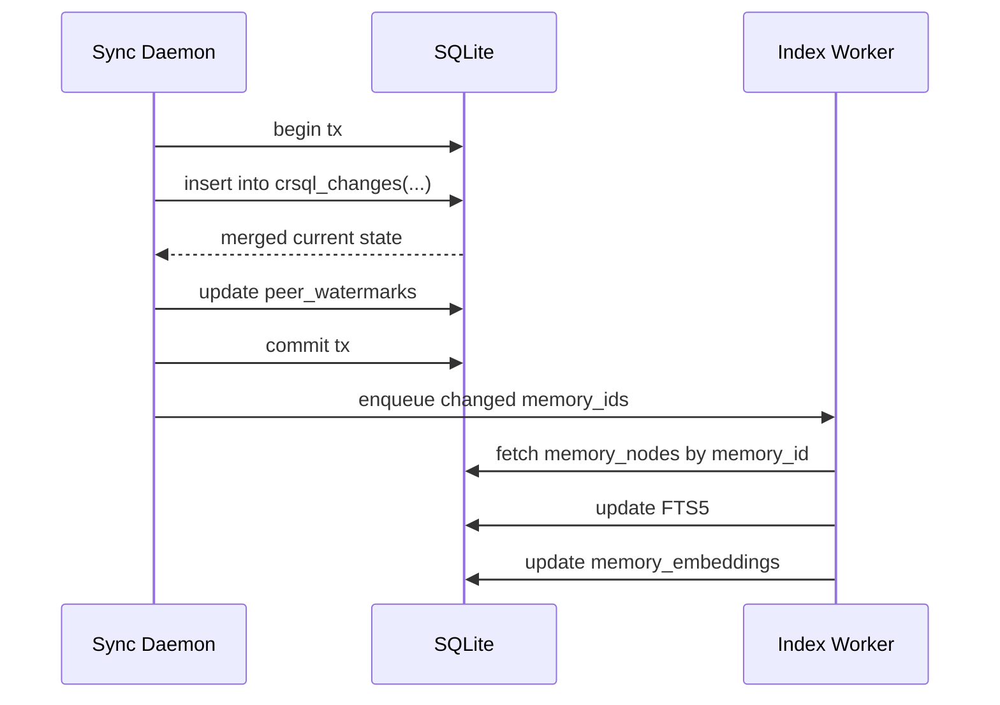
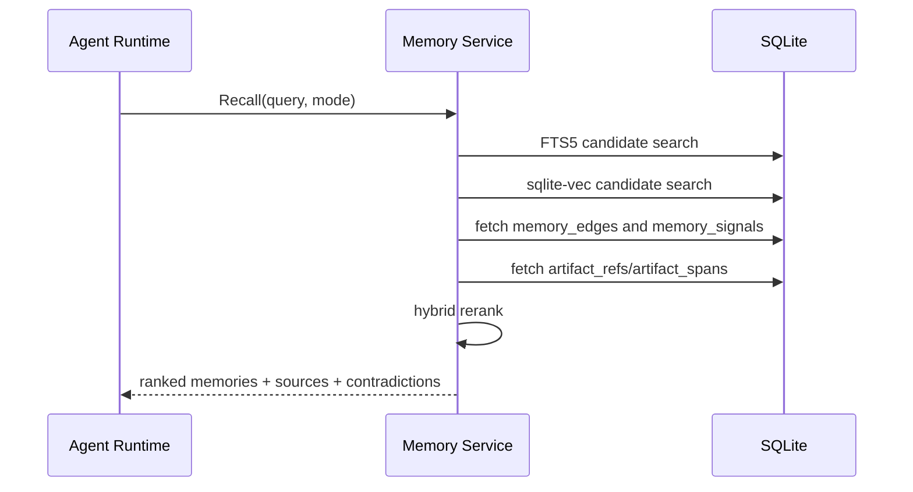
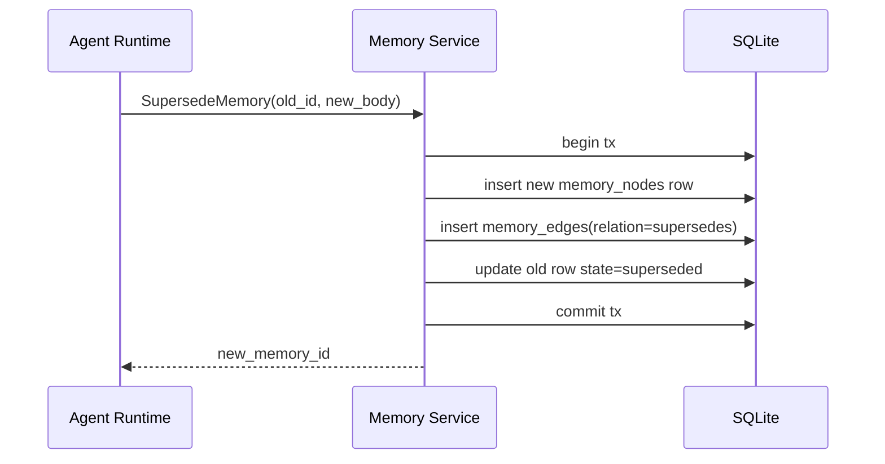
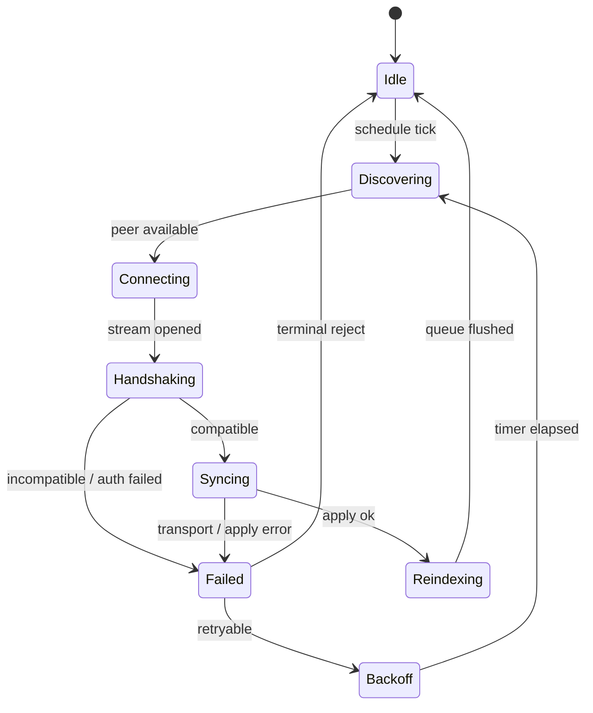

# Workflows

Status: Draft v0.2
Date: 2026-03-10

## 1. Components In Scope

- `Agent Runtime`
- `Memory Service`
- `SQLite`
- `Index Worker`
- `Sync Daemon`
- `Iroh Transport`
- `Remote Peer`

## 2. Workflow A: Local Memory Ingestion

目的:

- ローカルで記憶を作る
- 同期の有無に依存せず完結する
- 出典と関係を同時に保存する

完了条件:

- `memory_nodes` に append されている
- 必要な `artifact_refs` と `memory_edges` が存在する
- index queue に対象が積まれている

ここでやらないこと:

- peer への直接送信
- embedding の共有
- trust policy の変更

## 3. Workflow B: Peer Handshake And Delta Sync

目的:

- peer identity を確認する
- protocol/schema compatibility を確認する
- `crsql_changes` の差分だけを送受信する

完了条件:

- allowlist で許可された peer だけが同期に進む
- `schema_hash` 不一致は即 reject
- 同期 payload は changeset batch のみ

ここでやらないこと:

- query API の中継
- vector blob の送信
- relay への永続保存

## 4. Workflow C: Change Apply And Local Reindex

目的:

- 受信差分を安全に適用する
- 必要な memory だけ再索引する

完了条件:

- `crsql_changes` 適用が冪等である
- reindex は changed memory のみ対象
- 受信順序が前後しても最終収束する

## 5. Workflow D: Recall And Decision Trace

目的:

- recall をローカル DB だけで完結させる
- supporting artifact と contradiction を返せるようにする

ranking inputs:

- lexical relevance
- semantic similarity
- graph proximity
- temporal relevance
- trust weight

ここでやらないこと:

- remote peer への live query
- vector synchronization
- remote re-ranking

## 6. Workflow E: Memory Correction By Supersede

目的:

- semantic overwrite を避ける
- 履歴説明可能性を残す

設計意図:

- 古い memory を hard delete しない
- graph から更新関係を説明できる
- cell-wise merge に semantic overwrite を持ち込まない

## 7. Workflow F: Sync Retry And Backoff

retry policy:

- transport failure は exponential backoff
- schema mismatch は terminal reject
- auth failure は terminal reject
- apply failure は quarantine queue に逃がす

## 8. Workflow Ownership Matrix

| Workflow | Main owner | Secondary owner |
| --- | --- | --- |
| Local ingestion | Memory Service | Index Worker |
| Peer handshake | Sync Daemon | Iroh transport wrapper |
| Change apply | Sync Daemon | SQLite adapter |
| Recall | Memory Service | Index Worker |
| Supersede | Memory Service | SQLite adapter |
| Retry/backoff | Sync Daemon | peer policy module |

