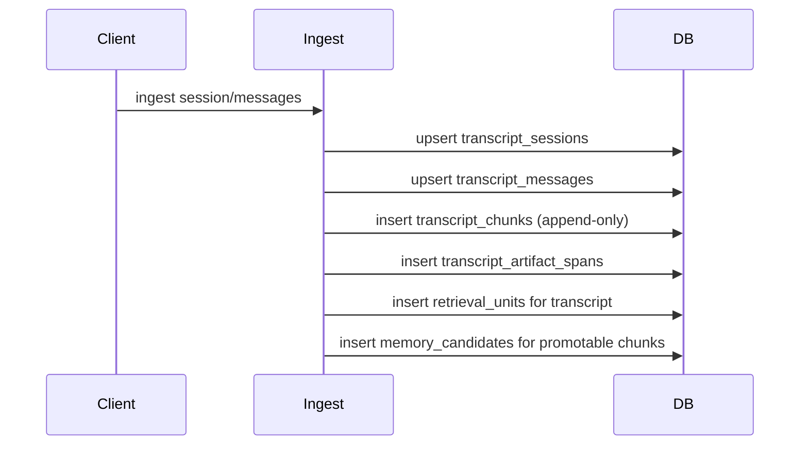
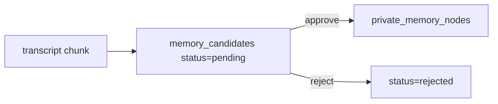
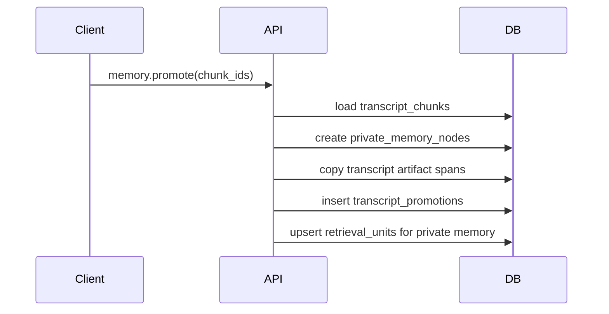
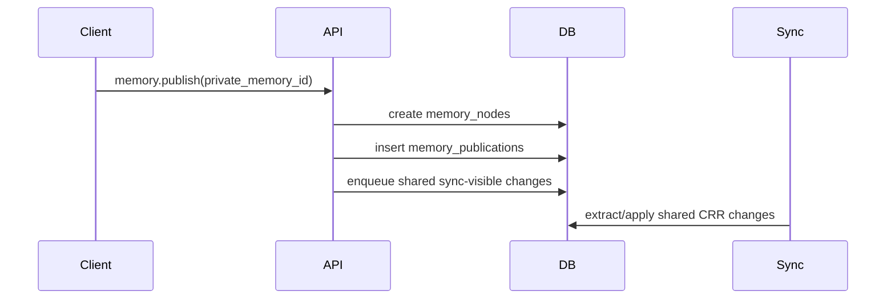
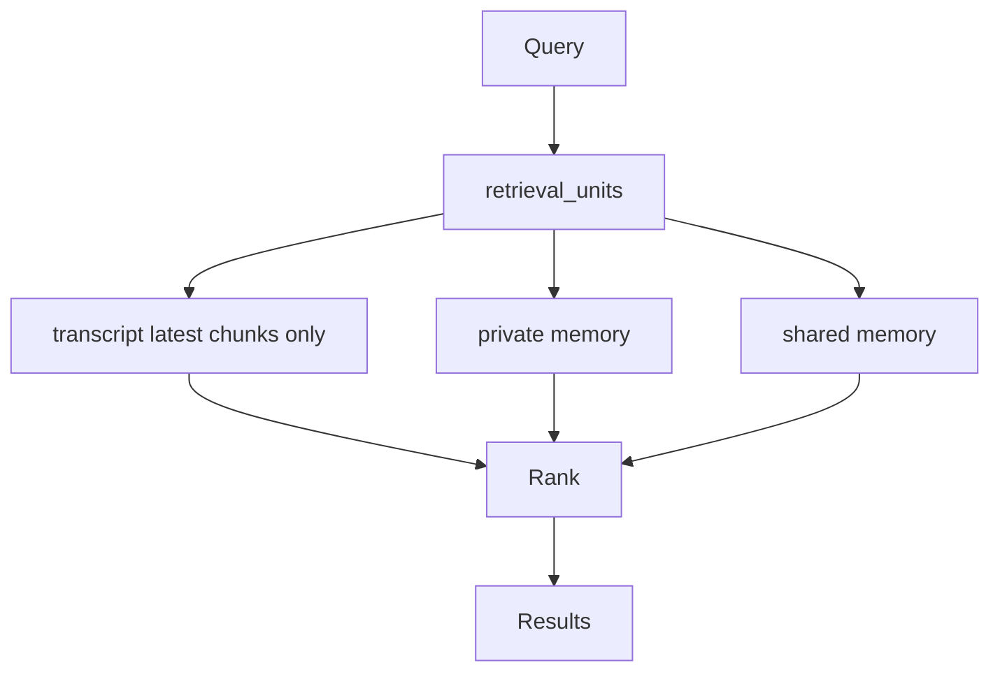
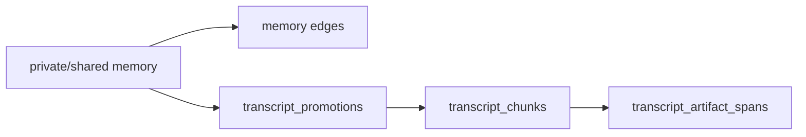

# Workflows

Status: Current reference
Date: 2026-03-26

## 1. Transcript Ingest

要点:

- transcript chunk は append-only
- 同一 session の旧 chunk version は残す
- candidate はまだ正式 memory ではない

## 2. Candidate Triage

要点:

- approve でのみ正式 private memory を作る
- reject は transcript を消さない
- provenance は chunk link のまま保持される

## 3. Manual Promote

## 4. Publish

## 5. Recall

要点:

- transcript/private/shared を unified recall する
- transcript は各 session の最新 `chunk_strategy_version` だけ対象
- old chunk は trace 用に残す

## 6. Trace Decision

要点:

- trace は memory graph と transcript provenance の両方を返す
- promote 後に chunk version が増えても、既存 promotion link は壊さない

## 7. Shared Sync Boundary

- sync 対象は shared table family のみ
- private memory, transcript, candidate は peer に同期しない
- transcript から shared へ行くには `promote -> publish` の 2 段階が必要
